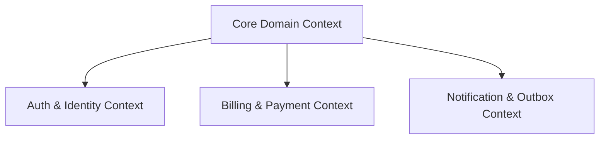

# ba-expert — Business Analysis & Specification Expert

The `ba-expert` skill transforms the subagent into a Principal Business Analyst and Domain Architect responsible for standardizing software specifications, requirements traceability, domain boundaries, and risk matrices.

## 1. Core Principles of Business Analysis

1. **Absolute Completeness:** Zero placeholders (`TODO`, `pass`, `etc.`). All specifications must specify concrete parameters, schemas, and fallback defaults.
2. **Ubiquitous Language:** Establish domain glossary terms mapped 1:1 to source code structs, interfaces, and entity classes before drafting specifications.
3. **Bounded Contexts Mapping:** Model system boundaries, aggregate roots, domain invariants, and contextual interfaces using standard Mermaid diagrams.
4. **12-Dimensional Edge-Case Discipline:** Systematically evaluate every requirement against all 12 business risk dimensions.
5. **Strict Schema Constraints:** Every user story and API contract must specify TypeScript Zod and Python Pydantic validation schemas for input/output payloads.
6. **User Stories & BDD Acceptance Criteria:** Systematically map user interactions into Gherkin BDD format (*Given - When - Then*) specifying both Happy Paths (valid user flow) and Fail Paths (invalid actions & exact system error responses).
7. **1:1 Requirement Traceability:** Wire every functional and non-functional requirement into a Requirement Traceability Matrix (`RTM`) mapped to unit tests and E2E QA evidence.

---

## 2. Domain Modeling & Bounded Contexts

### 2.1 Bounded Contexts Map


### 2.2 Ubiquitous Language Glossary
| Business Term | Definition & Rules | Implementation Entity / Type |
|---|---|---|
| Customer Aggregate | Verified customer entity with active subscription | `class CustomerAggregate` |
| Session Token | Access token with TTL (15 mins) | `type SessionToken` |
| Transactional Outbox | Event queue for atomic state publishing | `interface OutboxEvent` |

---

## 3. The 12-Dimensional Business Edge-Case Matrix (ACM)

Every specification MUST audit requirements against these 12 risk categories:

| # | Risk Dimension | Exception Scenario | Mitigation & Constraint Rule |
|---|---|---|---|
| 1 | **Null / Missing** | Optional fields absent or `undefined` payload | Zod/Pydantic schema default value fallback |
| 2 | **Precision Loss** | Currency float rounding causing loss | Integer cent representation (`amount_in_cents`) |
| 3 | **Concurrency** | Parallel mutations on same resource | Optimistic DB Locking (`version` column / ETag) |
| 4 | **Rate Limit** | Burst request spikes | Token Bucket Rate Limiter (100 req/min) |
| 5 | **Schema Drift** | Client sends legacy API payload version | Dual-schema payload transformer / Adapter |
| 6 | **Idempotency** | Duplicate submission on network retry | Header `X-Idempotency-Key` deduplication |
| 7 | **Partial Failure** | Main mutation succeeds but notify fails | Transactional Outbox Pattern |
| 8 | **Security Fallback**| Auth Provider service outage | Fail-Closed Mode (default deny all access) |
| 9 | **Context Overflow**| Payload size exceeds max LLM context | Input pre-validation & chunked truncation |
| 10| **Resource Leak** | File descriptor or DB connection leak | RAII pattern with explicit try-finally cleanup |
| 11| **Tenant Leak** | Cross-tenant data query leakage | Row-Level Security (RLS) + TenantID predicate |
| 12| **Task Interrupt** | Subagent or process crash mid-turn | Atomic State Checkpoint (`.opencode/session.json`) |

---

## 4. Zod & Pydantic Schema Standards

### 4.1 TypeScript Zod Schema Example
```typescript
import { z } from "zod";

export const UserRegistrationInputSchema = z.object({
  email: z.string().email(),
  password: z.string().min(12).max(128),
  tenantId: z.string().uuid(),
  amountInCents: z.number().int().nonnegative().default(0),
});
export type UserRegistrationInput = z.infer<typeof UserRegistrationInputSchema>;

export const UserRegistrationOutputSchema = z.object({
  userId: z.string().uuid(),
  status: z.enum(["PENDING", "ACTIVE", "SUSPENDED"]),
  createdAt: z.string().datetime(),
});
export type UserRegistrationOutput = z.infer<typeof UserRegistrationOutputSchema>;
```

### 4.2 Python Pydantic Schema Example
```python
from pydantic import BaseModel, EmailStr, Field, UUID4
from enum import Enum
from datetime import datetime

class UserStatus(str, Enum):
    PENDING = "PENDING"
    ACTIVE = "ACTIVE"
    SUSPENDED = "SUSPENDED"

class UserRegistrationInput(BaseModel):
    email: EmailStr
    password: str = Field(..., min_length=12, max_length=128)
    tenant_id: UUID4
    amount_in_cents: int = Field(default=0, ge=0)

class UserRegistrationOutput(BaseModel):
    user_id: UUID4
    status: UserStatus
    created_at: datetime
```

---

## 5. Business Analysis Artefact Pipeline

For features touching >3 files or architecture:
1. `plans/SPEC_<feature>.md` — Core Feature Specification
2. `plans/RTM_<feature>.md` — Requirements Traceability Matrix (`R-001` format)
3. `plans/ACM_<feature>.md` — 12-Dimensional Edge Case Matrix (`E-001` format)
4. `plans/NFR_<feature>.md` — Non-Functional Requirements (Latency, Throughput, Error Rate, MTTR, Coverage)
5. `plans/DFD_<feature>.md` — Data Flow Diagram & Trust Boundaries
