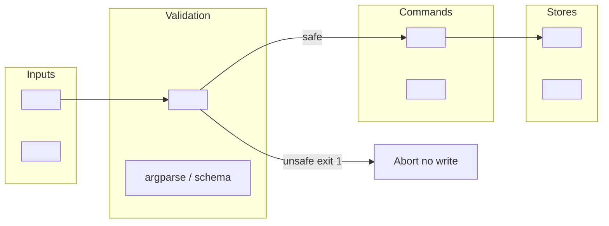
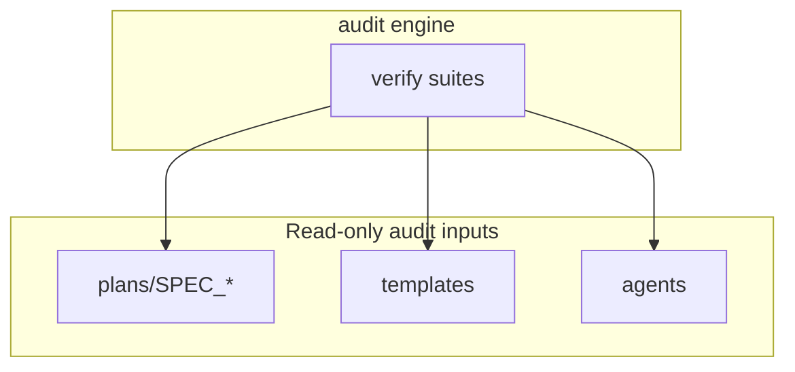

# Reference: DFD (Data Flow Diagram & Trust Boundaries) Template

---

## File Header

```markdown
# DFD: <feature_name> — Data Flow & Trust Boundaries

> **Status:** Draft
> **Author:** Planner Agent (ba-expert)
> **Date:** YYYY-MM-DD
> **Parent SPEC:** `plans/SPEC_<feature>.md`
```

---

## 8 Sections (ALL recommended for architecture-scale features)

### Section 1: Context Diagram (Level 0)

Show external actors/systems vs trust boundary containing the system. Use `flowchart TB`:

```mermaid
flowchart TB
    subgraph External["Untrusted / External"]
        User[Actor / Caller]
        ExtSys[External System]
    end

    subgraph System["Trust Boundary: <system>"]
        Entry[Entry point]
        Core[Core logic]
        Store[Data store]
    end

    User -->|<input type>| Entry
    ExtSys -->|<protocol>| Entry
    Entry --> Core
    Core --> Store
    Core -->|<output type>| User
```



### Section 2: Level 1 — Command / Request Flows

Detail internal flows per command/endpoint:



### Section 3: Sequence Diagram (critical flow detail)

For the most security-sensitive flow (e.g., init, payment, auth):

```mermaid
sequenceDiagram
    participant U as User/CI
    participant CLI as <entry>
    participant V as <validator>
    participant Core as <core module>
    participant FS as <store/filesystem>

    U->>CLI: <command> <args>
    CLI->>V: validate(<input>)
    alt unsafe
        V-->>CLI: False + reason
        CLI-->>U: exit 1 (What/Context/Fix)
    else safe
        V-->>CLI: <resolved>
        CLI->>Core: <operation>
        Core->>FS: <read/write>
        Core-->>CLI: <result>
        CLI-->>U: exit 0 summary
    end
```



### Section 4: Trust Boundary Table

```markdown
## Trust Boundaries

| Boundary | Inside (trusted) | Outside (untrusted) | Controls |
|----------|------------------|---------------------|----------|
| TB-1 <name> | <trusted code/data> | <untrusted input/source> | <control mechanism> |
| TB-2 <name> | ... | ... | ... |
```

### Section 5: Main Data Flows (narrative)

Numbered narrative of each major flow path. 1 flow per paragraph:

```markdown
## Main Data Flows

1. **<Flow name>:** <actor> <action> → <component> → <result>.
2. **<Flow name>:** ...
```

### Section 6: Data Stores & Sensitivity

```markdown
## Data Stores & Sensitivity

| Store | Sensitivity | Read by | Write by |
|-------|-------------|---------|----------|
| <store path> | <Public/Internal/High> | <components> | <components> |
```

### Section 7: Threat → Control Trace

Map each threat to a DFD element, a control, and a requirement:

```markdown
## Threat → Control Trace

| Threat | DFD element | Control | Req |
|--------|-------------|---------|-----|
| <threat> | TB-<n> | <control> | R-<NNN> |
```

### Section 8: Verify / Audit Flow (if applicable)

For CLI/audit systems, show how verify/doctor reads inputs:



---

## Verify Contract Notes

- `ockit verify --suite ba-qa` checks SPEC_TEMPLATE contains marker `DFD`.
- DFD is in companion file `plans/DFD_<feature>.md` for 5-file pattern, or inline in SPEC §2 for 1-file pattern.
- Mermaid diagrams must use `flowchart` or `sequenceDiagram` (valid Mermaid syntax).
- Every trust boundary (TB-<n>) should map to at least one RTM requirement.
