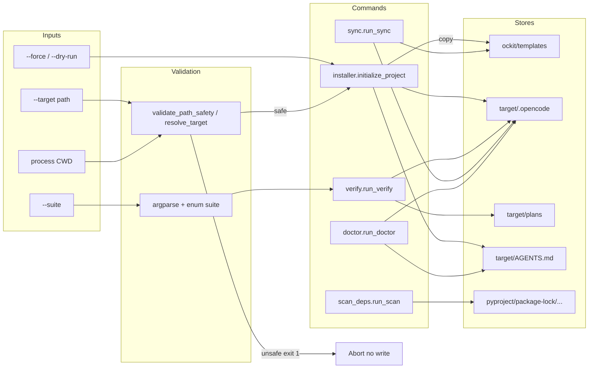
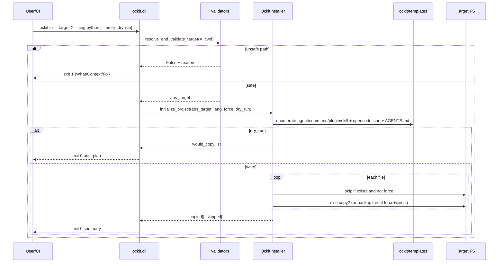
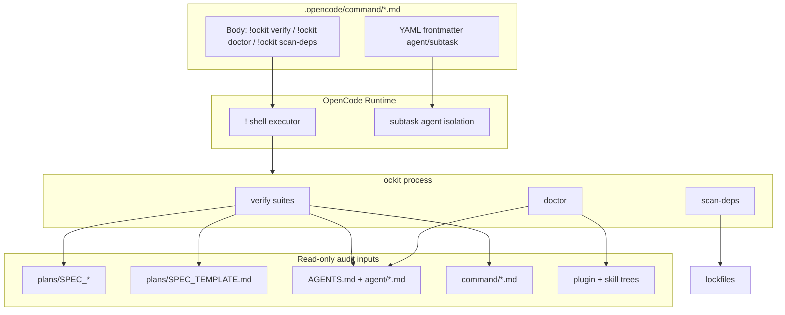

# DFD: opencode_nativeness — Data Flow & Trust Boundaries

> **Status:** Draft  
> **Author:** Planner Agent (ba-expert)  
> **Date:** 2026-08-07  
> **Parent SPEC:** `plans/SPEC_opencode_nativeness.md`

---

## 1. Context Diagram (Level 0)

```mermaid
flowchart TB
    subgraph External["Untrusted / External"]
        User[Developer / CI]
        PyPI[pip / wheel install]
        OC[OpenCode CLI runtime]
        FS_Foreign[Foreign target filesystem]
    end

    subgraph OckitPkg["Trust Boundary: ockit package"]
        CLI[ockit CLI]
        TPL[Packaged templates<br/>ockit/templates]
        Core[installer / verify / sync / doctor / scan_deps / validators]
    end

    subgraph Project["Trust Boundary: target project repo"]
        OCDir[.opencode/]
        Plans[plans/SPEC_*]
        AgentsMd[AGENTS.md]
        BinWrap[bin/* thin wrappers]
        Plugins[plugin/*.js hooks]
    end

    User -->|CLI args --target --force| CLI
    PyPI -->|install wheel + package-data| TPL
    CLI --> Core
    Core -->|read only| TPL
    Core -->|validated write| OCDir
    Core -->|validated write| AgentsMd
    Core -->|read audit| Plans
    Core -->|read audit| OCDir
    User -->|slash commands| OC
    OC -->|!ockit / tool hooks| CLI
    OC --> Plugins
    Plugins -->|deny/allow path| FS_Foreign
    BinWrap -->|exec ockit| CLI
```

---

## 2. Level 1 — CLI Command Flows

---

## 3. Init Data Flow (detail)

---

## 4. Verify / Command Nativization Flow

---

## 5. Trust Boundaries

| Boundary | Inside (trusted) | Outside (untrusted) | Controls |
|----------|------------------|---------------------|----------|
| TB-1 Package | `src/ockit/**` code + packaged templates | PyPI consumers, local editable installs | package-data correctness; no secrets in templates |
| TB-2 CLI args | parsed enums, validated paths | raw argv, env, CWD | `validators.validate_path_safety` / target resolver |
| TB-3 Target write | writes under resolved target `.opencode/`, root AGENTS.md | rest of filesystem | realpath commonpath check; deny `..` |
| TB-4 OC plugins | hook logic in quality-gate | agent-chosen tool paths | deny sensitive patterns + traversal before execute |
| TB-5 Command shell | `!ockit …` fixed verbs | freeform agent bash | prefer fixed ockit subcommands over ad-hoc scripts |
| TB-6 Personal → portable | author machine config | shipped template | strip home paths, apiKeys (R-017) |

---

## 6. Main Data Flows (narrative)

1. **Install path:** Developer `pip install ockit` → wheel embeds `ockit/templates/**` → `ockit init` reads only package templates → writes target project scaffold.
2. **Day-2 verify path:** Slash `/gate` or `/plan` → `!ockit verify` → reads plans + .opencode → stdout audit → exit code gates pipeline.
3. **Sync path (maintainers):** Edit live `.opencode/` → `ockit sync --check` detects drift → `ockit sync --sync` copies active → package templates (dev repo only).
4. **Plugin path:** Agent tool call with file path → `tool.execute.before` quality-gate → allow/deny → no data exfil of `.env` via ockit hooks.
5. **Compat path:** Legacy CI calls `./bin/validate-traceability.sh` → exec `ockit verify` → same audit engine.

---

## 7. Data Stores & Sensitivity

| Store | Sensitivity | Read | Write |
|-------|-------------|------|-------|
| `ockit/templates/**` | Public scaffold; must be portable | installer, sync | sync --sync (maintainer) |
| `target/.opencode/**` | Project config; may gain local secrets if user edits | doctor, verify | init, user, OC |
| `plans/SPEC_*` | Project IP; no secrets expected | verify | planner agent |
| `AGENTS.md` | Project rules | doctor, verify | init, user |
| Lockfiles | Supply chain | scan-deps | package managers |
| Author `opencode.json` local | **High** if apiKeys/home paths | never ship | user only; not template |

---

## 8. Threat → Control Trace

| Threat | DFD element | Control | Req |
|--------|-------------|---------|-----|
| Path traversal write | TB-2/3 | validators + realpath | R-006 |
| Personal path leak into foreign repos | TB-6 | portable template scan | R-017 |
| Secret file edit via agent | TB-4 | quality-gate plugin | R-018 |
| Dead script / missing bin break CI | Compat path | thin wrappers + nativize commands | R-011, R-015 |
| Wheel missing templates | TB-1 | package-data + init fail-fast | R-004 |
| Built-in agent clobber | OCDir agents | stop shipping explore/general/compaction | R-008 |
