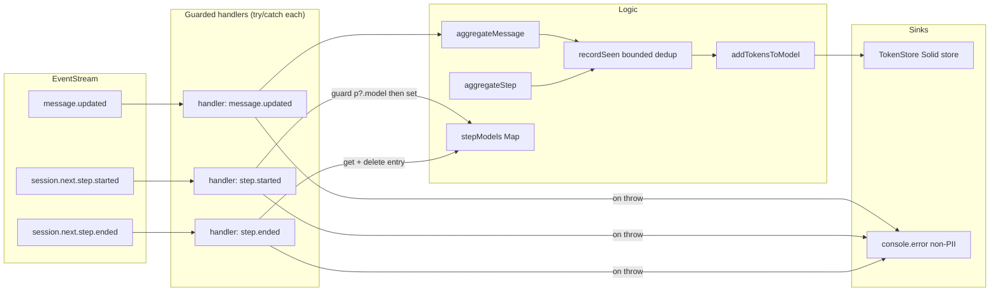
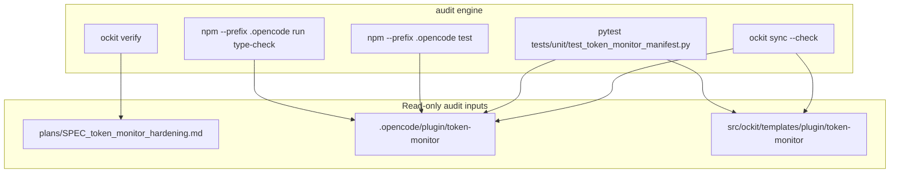

# DFD: token_monitor_hardening — Data Flow & Trust Boundaries (Delta)

> **Status:** Draft
> **Author:** Planner Agent (ba-expert)
> **Date:** 2026-08-07
> **Parent SPEC:** `plans/SPEC_token_monitor_hardening.md`
> **Extends:** `plans/DFD_token_monitor_plugin.md` — delta only; flows/stores/boundaries not listed here are unchanged from the parent.

---

## 1. Context Diagram (Level 0)

```mermaid
flowchart TB
    subgraph External["Untrusted / External"]
        OC[OpenCode TUI Host]
        SDK[OpenCode SDK Event Stream]
        CONSOLE[Host console (stderr)]
    end

    subgraph Plugin["Trust Boundary: .opencode/plugin/token-monitor"]
        IDX[plugin/token-monitor/index.ts]
        EVH[Guarded Event Handlers try/catch]
        STORE[token-state.ts Solid Store]
        PANEL[token-panel.tsx]
        POLL[lifecycle.ts Poller]
    end

    SDK -->|"message.updated"| EVH
    SDK -->|"session.next.step.started/ended"| EVH
    EVH -->|"aggregateMessage / aggregateStep (guard: time?.completed, model?.)"| STORE
    EVH -->|"handler failure → [token-monitor] <event> handler failed"| CONSOLE
    POLL -->|"tick signal (30s)"| PANEL
    STORE -->|"getModels()"| PANEL
    PANEL -->|"sidebar_content slot JSX"| OC
    OC -->|"loads tui.json → ./plugin/token-monitor"| IDX
    IDX -->|"onDispose: unsubs + clear stepModels + stop"| POLL
```

## 2. Level 1 — Command / Request Flows



## 3. Sequence Diagram (critical flow — guarded handler isolation)

```mermaid
sequenceDiagram
    participant OC as OpenCode TUI Host
    participant IDX as index.ts (tui)
    participant EV as Event Bus
    participant AGG as token-state.ts
    participant CONSOLE as Host console

    OC->>IDX: load tui.json plugin
    IDX->>EV: on(message.updated) [try/catch]
    IDX->>EV: on(session.next.step.started) [try/catch + model? guard]
    IDX->>EV: on(session.next.step.ended) [try/catch + delete stepModels]
    OC->>EV: malformed message.updated (time undefined)
    EV->>IDX: message.updated {info, time absent}
    IDX->>AGG: aggregateMessage(store, msg)
    AGG->>AGG: time?.completed → undefined → return false
    AGG-->>IDX: false (no throw)
    OC->>EV: step.started with missing model
    EV->>IDX: session.next.step.started {properties, model absent}
    IDX->>IDX: model?.providerID guard → silent return
    OC->>EV: step.started then step.ended (valid)
    EV->>IDX: session.next.step.started
    IDX->>IDX: stepModels.set(id, model)
    EV->>IDX: session.next.step.ended
    IDX->>IDX: model = stepModels.get(id); stepModels.delete(id)
    IDX->>AGG: aggregateStep(store, p, model)
    alt handler throws unexpectedly
        IDX->>CONSOLE: [token-monitor] <event> handler failed: <message>
        IDX-->>EV: continue (later listeners run)
    end
```

## 4. Trust Boundaries

| Boundary | Inside (trusted) | Outside (untrusted) | Controls |
|----------|------------------|---------------------|----------|
| TB-1 Plugin load | `tui.json` entry, plugin module | TUI host config, filesystem path | unchanged (repo-relative path; no external resolution) |
| TB-2 SDK events | aggregation + store logic | raw SDK event payloads | STRENGTHENED: `time?.completed` guard (R-001), `model?.` guard (R-004), per-handler try/catch isolation (R-004) |
| TB-3 Render | panel JSX + formatters | host slot renderer (OpenTUI FFI) | unchanged (display-only rounding; no state mutation in render path) |
| TB-4 Lifecycle | polling + dispose handlers | host signal / abort | unchanged (AbortSignal cleanup, idempotent cleanup, `onDispose` unsub + `stepModels.clear()`) |
| TB-5 Error sink | plugin error strings | host console (stderr) | one-line non-PII `console.error` (event type + error message; never raw payload) |

## 5. Main Data Flows (delta)

1. **Message aggregation flow (hardened):** `message.updated` handler wraps body in try/catch; `aggregateMessage` checks `msg.tokens`, then `msg.time?.completed` (optional chain — missing `time` → skip, no TypeError), then `recordSeen` (bounded dedup), then adds token/cost to `PerModelTotals`.
2. **Step model attribution flow (bounded):** `session.next.step.started` stores `assistantMessageID → {providerID, modelID}` in `stepModels` only when `p?.assistantMessageID` and `model?.providerID/id` are present; matching `step.ended` reads, aggregates, then **deletes** the entry — map holds in-flight steps only — map holds in-flight steps only.
3. **Dedup flow (capped):** `recordSeen` returns `false` on duplicate id (dedup intact), otherwise inserts and — at `MAX_SEEN_ENTRIES` — evicts the oldest FIFO entry (`seen.values().next()`), keeping the set ≤ 10,000.
4. **Error isolation flow (new):** any handler throw is caught per-handler and logged as `[token-monitor] <event-type> handler failed: <error message>` to console.error; no payload/PII logged; remaining listeners and the slot render continue.

## 6. Data Stores & Sensitivity

| Store | Sensitivity | Read by | Write by | Bound |
|-------|-------------|---------|----------|-------|
| `TokenStore` (in-memory Solid store) | Public (aggregated usage stats, no PII) | `token-panel.tsx` | `aggregateMessage`, `aggregateStep` | ≤ 50 model entries (unchanged) |
| `seen: Set<messageID>` | Public | dedup checks | `recordSeen` (both aggregators) | ≤ 10,000 entries (NEW cap) |
| `stepModels: Map<assistantMessageID, {providerID, modelID}>` | Public | step.ended handler | step.started handler (create), step.ended handler (delete) | ≤ concurrent in-flight steps (NEW: delete-on-ended) |
| Host console (stderr) | Public (error strings) | — | handler catch blocks | one line per failure (NEW sink) |

## 7. Threat → Control Trace

| Threat | DFD element | Control | Req |
|--------|-------------|---------|-----|
| Unguarded `msg.time.completed` TypeError in handler (schema drift) | TB-2 | `msg.time?.completed` optional-chain guard (skip, no throw) | R-001 |
| Unguarded `p.model.providerID` TypeError in step.started | TB-2 | `model?.providerID` / `model?.id` guard + try/catch | R-004 |
| Listener throw skips later listeners / crashes host emitter | TB-2 / TB-5 | per-handler try/catch + console.error (Node-style emitter isolation restored) | R-004 |
| Unbounded `seen` set (1 entry per message, whole session) | Store | `MAX_SEEN_ENTRIES=10000` FIFO eviction | R-003 |
| Unbounded `stepModels` map (1 entry per completed step) | Store | delete entry in step.ended after read | R-002 |
| Eviction / composite-key regressions | Store | 51-model eviction test + composite modelKey test | R-005 |
| Seen-cap regression | Store | seen-cap FIFO eviction test | R-006 |
| Sync drift after source change | TB-1 | byte-identical template mirror (test_r009 + test_r012) | R-007 |

## 8. Verify / Audit Flow


