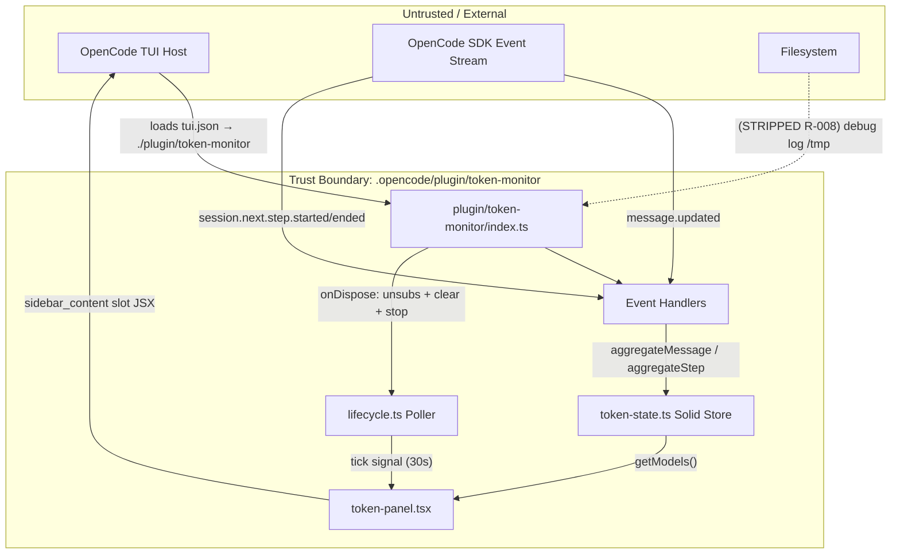
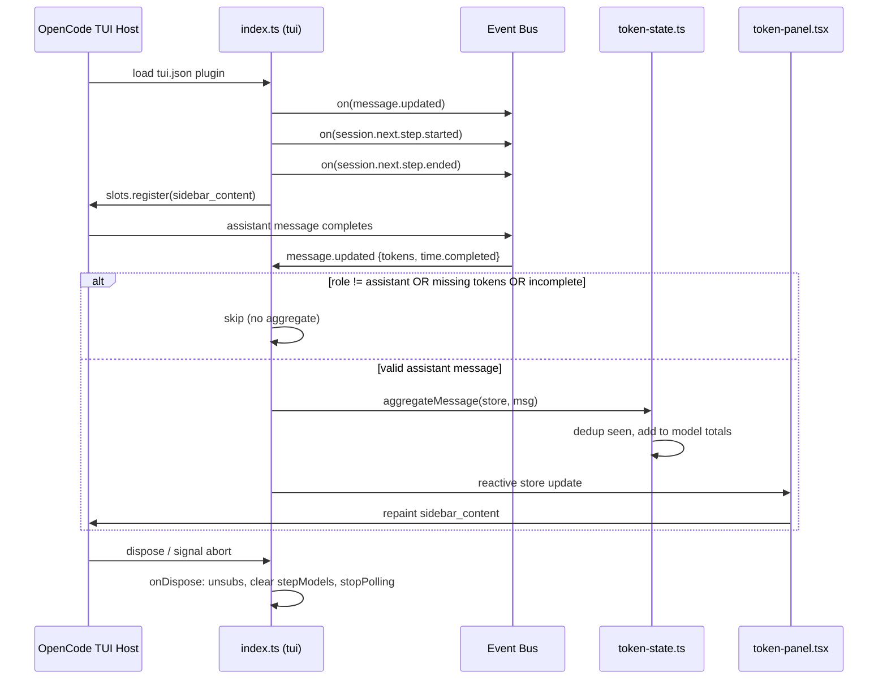
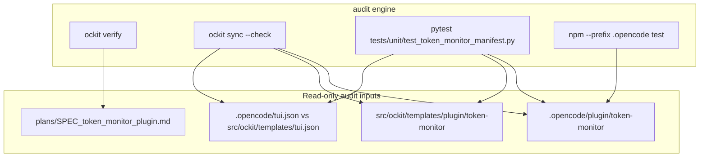

# DFD: token_monitor_plugin — Data Flow & Trust Boundaries

> **Status:** Draft
> **Author:** Planner Agent (ba-expert)
> **Date:** 2026-08-07
> **Parent SPEC:** `plans/SPEC_token_monitor_plugin.md`

---

## 1. Context Diagram (Level 0)



## 2. Level 1 — Command / Request Flows

```mermaid
flowchart LR
    subgraph Host
        TUI[tui.json registry]
        SLOT[sidebar_content slot]
    end

    subgraph PluginEntry
        IDX[index.ts tui()]
        CONFIG[config.ts parsePollInterval]
        RUNTIME[solid-runtime.ts]
        STORE_RT[store-runtime.ts]
    end

    subgraph Logic
        AGG[aggregateMessage]
        AGG2[aggregateStep]
        ST[createTokenStore]
    end

    TUI -->|plugin path| IDX
    IDX -->|options| CONFIG
    CONFIG -->|clamped intervalMs| POLL[lifecycle.ts startPolling]
    IDX -->|api.event.on| AGG
    IDX -->|api.event.on| AGG2
    AGG --> ST
    AGG2 --> ST
    ST --> STORE_RT
    IDX -->|slots.register| SLOT
    SLOT --> PANEL[token-panel.tsx]
    PANEL --> RUNTIME
    RUNTIME -->|createSignal/createMemo/For| PANEL
    POLL -->|tick| PANEL
```

## 3. Sequence Diagram (critical flow — event → aggregate → render)



## 4. Trust Boundaries

| Boundary | Inside (trusted) | Outside (untrusted) | Controls |
|----------|------------------|---------------------|----------|
| TB-1 Plugin load | `tui.json` entry, plugin module | TUI host config, filesystem path | path is repo-relative `./plugin/token-monitor`; no external resolution |
| TB-2 SDK events | aggregation + store logic | raw SDK event payloads | defensive guards: skip missing `tokens`/`time.completed`; role filter assistant |
| TB-3 Render | panel JSX + formatters | host slot renderer (OpenTUI FFI) | display-only rounding; no state mutation in render path |
| TB-4 Lifecycle | polling + dispose handlers | host signal / abort | AbortSignal cleanup, idempotent cleanup, `onDispose` unsub |

## 5. Main Data Flows

1. **Plugin load flow:** TUI host reads `.opencode/tui.json`, resolves `./plugin/token-monitor`, imports default export `{ id, tui }`, calls `tui(api, options)`.
2. **Message aggregation flow:** `message.updated` event with `role=assistant`, `tokens`, `time.completed` → `aggregateMessage` dedups by message id, adds token/cost counts to `PerModelTotals` keyed by `providerID/modelID`.
3. **Step aggregation flow:** `session.next.step.started` records model for `assistantMessageID`; matching `session.next.step.ended` aggregates tokens via shared `seen` set (no double count with flow 2).
4. **Render flow:** `sidebar_content` slot returns `TokenPanel` wired to store `getModels()` + tick signal; Solid reactivity repaints on store/tick change.
5. **Dispose flow:** `lifecycle.onDispose` unsubscribes all three event listeners, clears `stepModels`, stops polling.

## 6. Data Stores & Sensitivity

| Store | Sensitivity | Read by | Write by |
|-------|-------------|---------|----------|
| `TokenStore` (in-memory Solid store) | Public (aggregated usage stats, no PII/secrets) | `token-panel.tsx` (getModels) | `aggregateMessage`, `aggregateStep` |
| `seen: Set<messageID>` | Public | dedup checks | both aggregators |
| `stepModels: Map<assistantMessageID, {providerID, modelID}>` | Public | step.ended handler | step.started handler |
| `tui.json` (repo file) | Internal config | TUI host loader | developers (registration) |

## 7. Threat → Control Trace

| Threat | DFD element | Control | Req |
|--------|-------------|---------|-----|
| Malformed event crashes plugin | TB-2 | defensive guards skip missing fields; no throw | R-013 |
| Double-count spend (dual event sources) | Flow 2+3 | shared `seen` dedup set | R-013 |
| Zombie interval / leaked listeners | TB-4 | AbortSignal + `onDispose` unsub + idempotent cleanup | R-014, R-015 |
| Unbounded memory (many models) | Store | `MAX_MODEL_ENTRIES=50` eviction | R-013 |
| Cross-session state bleed | Store | per-`tui()` store instance | R-015 |
| Debug artifact in shipped template | TB-1 / FS | R-008 strips TEMPORARY debug block; manifest test | R-008 |
| Missing runtime deps in scaffolded target | TB-1 | template `package.json` + AGENTS.md install note | R-011 |
| Version/schema drift (plugin API) | TB-1 | dependency pin `^1.18.12` + `tsc --noEmit` | R-003, R-007 |
| Secret/path leakage | All | portable templates, `test_no_leaked_config.py` | R-017 |

## 8. Verify / Audit Flow


