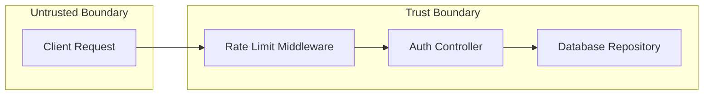

# SPEC: [FEATURE_NAME]

> **Status:** Draft | In Review | Approved  
> **Author:** [Planner Agent]  
> **Date:** YYYY-MM-DD  
> **Associated Artefacts:** `plans/RTM_[FEATURE].md`, `plans/ACM_[FEATURE].md`, `plans/NFR_[FEATURE].md`, `plans/DFD_[FEATURE].md`

---

## 1. Executive Summary & Business Analysis

### 1.1 Primary Goals & Non-Goals
- **Goals:** [Primary objective of the feature]
- **Non-Goals:** [Scope boundary — what is explicitly excluded]

### 1.2 Requirement Traceability Matrix (RTM) (`plans/RTM_[FEATURE].md`)

| Req ID | Business Requirement Description | Source | Priority | Target Component / File | Unit Test Reference | E2E QA Verification | Status |
|--------|----------------------------------|--------|----------|-------------------------|---------------------|---------------------|--------|
| R-001 | User registration with valid email & password | UX-Interview | P0 | `src/auth/register.ts` | `tests/test_auth.py::test_r001_register_success` | `tests/qa-evidence/auth/curl_register.log` | Pending |
| R-002 | Enforce rate limit (max 100 req/min per IP) | Arch-NFR | P1 | `src/middleware/rate_limit.ts` | `tests/test_rate_limit.py::test_r002_rate_limit_exceeded` | `tests/qa-evidence/auth/curl_rate_limit.log` | Pending |

### 1.3 Domain Modeling & Ubiquitous Language Glossary
- **Domain Entities:** User (`id`, `email`, `password_hash`, `status`), Session (`token`, `expires_at`).
- **Ubiquitous Language:** `CustomerAggregate` (verified customer), `SessionToken` (access credential).
- **User Journey:** Actor `[Unauthenticated User]` -> Submit Form -> System Validates Payload -> Hashes Password -> Creates User -> Returns JWT.

### 1.4 User Stories & Behavioral Acceptance Criteria (BDD / Gherkin Matrix)

#### Story US-01: [Feature User Story Title]
- **As a** `[Role/User Type]`
- **I want to** `[Perform Action / Feature Goal]`
- **So that** `[Achieve Business Value / Outcome]`

##### Happy Path Scenario (Success Flow)
- **Given** `[Pre-condition, e.g. Valid user session & correct input payload]`
- **When** `[User performs action, e.g. Submits valid registration form]`
- **Then** `[System responds with HTTP 201 Created & returns access token JWT]`

##### Fail Path Scenarios (Invalid Actions & Error Responses)
- **Scenario FP-01 (Missing Field)**: **Given** `[Missing password field in request]` **When** `[User submits form]` **Then** `[System responds with HTTP 400 Bad Request & error message 'Password is required']`
- **Scenario FP-02 (Duplicate Resource)**: **Given** `[Resource already exists in database]` **When** `[User submits creation]` **Then** `[System responds with HTTP 409 Conflict & error message 'Resource already exists']`
- **Scenario FP-03 (Unauthorized Action)**: **Given** `[Expired or invalid Bearer token]` **When** `[User calls endpoint]` **Then** `[System responds with HTTP 401 Unauthorized & error message 'Invalid session']`

---

## 2. Architecture & Data Flow Diagram (DFD) (`plans/DFD_[FEATURE].md`)



- **Main Data Flow:** Request enters untrusted boundary, crosses middleware validation, executes controller logic in trust boundary, mutates DB state, returns structured response.
- **Trust Boundaries:** External API endpoints must pass prompt/payload sanitization before crossing into core logic.

---

## 3. Interface & Schema Specification (Zod & Pydantic)

### API Endpoints

| Method | Path | Request Body | Response Schema | Status Codes |
|--------|------|-------------|-----------------|--------------|
| POST | `/api/v1/auth/register` | `{email: string, pass: string}` | `{user_id: string, token: string}` | 201, 400, 429 |

### Zod / Pydantic Data Validation Schemas
```typescript
import { z } from "zod";

export const RegisterInputSchema = z.object({
  email: z.string().email(),
  pass: z.string().min(12),
});
export type RegisterInput = z.infer<typeof RegisterInputSchema>;
```

---

## 4. Non-Functional Requirements (NFR) (`plans/NFR_[FEATURE].md`)

| Category | Target Metric / Floor Threshold | Verification Method |
|----------|--------------------------------|---------------------|
| Latency (p95) | < 300 ms local | QA cURL benchmark |
| Throughput | ≥ 100 ops/s sustained | Load test script |
| Error Rate | < 0.1% per session | System log audit |
| MTTR | < 60 s via auto-rollback | Rollback hook test |
| Coverage Floor | ≥ 85% lines, ≥ 70% branches | `pytest-cov` / `jest` |

---

## 5. File Mutation Manifest

| Action | File Path | Rationale & Responsibility |
|--------|-----------|----------------------------|
| Create | `src/auth/register.ts` | Endpoint handler implementing R-001 |
| Modify | `src/routes/index.ts` | Register auth route |
| Create | `tests/test_auth.py` | Unit + integration tests for auth module |

> **Constraint:** Subagents MUST NOT create or modify files outside this manifest.

---

## 6. Test Plan & 12-Dimensional Edge Case Matrix (ACM) (`plans/ACM_[FEATURE].md`)

### 6.1 Unit / Integration Tests (Given-When-Then)
- **Given** valid registration payload **When** `POST /api/v1/auth/register` **Then** returns HTTP 201 with JWT token.
- **Given** missing email field **When** `POST /api/v1/auth/register` **Then** returns HTTP 400 validation error.

### 6.2 12-Dimensional Business Edge Case Matrix (ACM)

| Edge ID | Risk Dimension | Test Scenario | Expected Result & Code | Test ID |
|---------|----------------|---------------|------------------------|---------|
| E-001 | 1. Null / Missing | Missing password key in payload | HTTP 400 Validation Error | T-EDGE-001 |
| E-002 | 2. Precision Loss | Currency fractional cents input | Rounded to integer cents | T-EDGE-002 |
| E-003 | 3. Concurrency | Parallel user registration attempt | 1 succeeds (201), 1 fails (409) | T-EDGE-003 |
| E-004 | 4. Rate Limit | Burst 150 req/min from single IP | HTTP 429 Rate Limit Exceeded | T-EDGE-004 |
| E-005 | 5. Schema Drift | Legacy API v1 payload submitted | Schema adapter converts v1 to v2 | T-EDGE-005 |
| E-006 | 6. Idempotency | Duplicate submission with same X-Idempotency-Key | Cached HTTP 201 response returned | T-EDGE-006 |
| E-007 | 7. Partial Failure | DB user saved, email notify fails | Transactional outbox retries notify | T-EDGE-007 |
| E-008 | 8. Security Fallback| Auth provider unreachable | Fail-closed HTTP 503 Service Unavailable | T-EDGE-008 |
| E-009 | 9. Context Overflow| Input string exceeding 100KB tokens | HTTP 400 Payload Too Large | T-EDGE-009 |
| E-010 | 10. Resource Leak | DB connection pool exhaustion | Connection closed in try-finally | T-EDGE-010 |
| E-011 | 11. Tenant Leak | Access tenant B data with tenant A credentials | HTTP 403 Forbidden (RLS enforced) | E-011 |
| E-012 | 12. Task Interrupt | Process killed mid-execution | Checkpoint state restored on restart | T-EDGE-012 |

---

## 7. Backward Compatibility & Security Audit

- [ ] OWASP-AI-01 Slopsquatting scanned (no hallucinated packages)
- [ ] OWASP-AI-02 IDOR authorization checks verified
- [ ] OWASP-AI-03 Input sanitization & parameterized queries enforced
- [ ] OWASP-AI-04 Hardcoded secrets scan clean
- [ ] OWASP-AI-05 Excessive agency & path sandboxing verified

---

## 8. Definition of Done & 3-State Verification

- [ ] All RTM (`R-001` format) requirements mapped 1:1 to passing unit/integration tests
- [ ] 12-Dimensional Edge Case Matrix (ACM) 100% covered in test suite
- [ ] Non-Functional Requirements (NFR) validated against quality floors
- [ ] Data Flow Diagram (DFD) trust boundaries verified
- [ ] 3-State Verification audit completed (`Confirmed` state on all claims)
- [ ] Stamped `plan-review` approval recorded
- [ ] `bin/validate-traceability.sh` and `bin/validate-phase10-ba-qa.sh` passed cleanly
- [ ] Conventional Commits recorded
