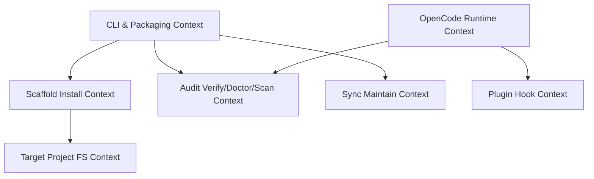
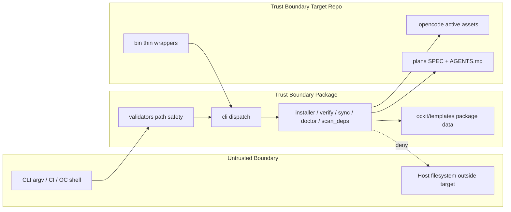

# SPEC: opencode_nativeness

> **Status:** Draft  
> **Author:** Planner Agent  
> **Date:** 2026-08-07  
> **Associated Artefacts:** `plans/RTM_opencode_nativeness.md`, `plans/ACM_opencode_nativeness.md`, `plans/NFR_opencode_nativeness.md`, `plans/DFD_opencode_nativeness.md`

---

## 1. Executive Summary & Business Analysis

### 1.1 Primary Goals & Non-Goals

- **Goals:**
  1. **Fidelity (Variant A):** Align shipped product with README/claims — real `ockit verify` / `ockit sync`; fix pip packaging so templates install; correct agent `mode` values; stop clobbering OpenCode built-ins; add root `AGENTS.md`.
  2. **Nativization (Variant B):** Port vanished `agy-kit/bin` logic into Python CLI + native OpenCode command frontmatter (`agent:`, `subtask:`, `!ockit …`); thin `bin/` wrappers only where DoD/CI require script names.
  3. **Portability:** Ship `opencode.json` template free of personal home paths, apiKeys, and author-only MCP/plugin pins.
  4. **Safety:** Path-safe `init --target`; idempotent scaffold; quality-gate path boundaries retained/enhanced.

- **Non-Goals:**
  1. Implement full Git worktree isolation CLI (`WorktreeManager` **DEFERRED** — module stays importable; no `ockit worktree` subcommand this release).
  2. Restore full 20-script `bin/` surface from agy-kit (only ≤3 thin wrappers).
  3. Port `synthesize-skill.sh`, `verify-eval-harness.sh`, `run-destructive-tests.sh`, `validate-brainstorm-skills.sh`, `agy-pipeline.sh`, full `fix_linter.py` CLI (linter shebang fix already in `ockit-linter-fixer.js`).
  4. Modify OpenCode upstream built-in agents/commands.
  5. Network-based CVE/OSV dependency audit in v1 `scan-deps` (pattern scan only).
  6. Feature logic outside scaffold/CLI/nativization scope (no app business domains).

### 1.2 Requirement Traceability Matrix (RTM) (`plans/RTM_opencode_nativeness.md`)

Full matrix: **28 requirements** `R-001` … `R-028`. Summary:

| Req ID | Business Requirement Description | Source | Priority | Target Component / File | Unit Test Reference | E2E QA Verification | Status |
|--------|----------------------------------|--------|----------|-------------------------|---------------------|---------------------|--------|
| R-001 | Real `ockit verify` traceability audit (SPEC_TEMPLATE + SPEC_*) | A#1 + validate-traceability.sh | P0 | `src/ockit/verify.py`, `cli.py` | `tests/unit/test_verify.py::test_r001_*` | `tests/qa-evidence/cli/verify_pass.log` | Pending |
| R-002 | `verify --suite ba-qa` absorbs phase10 BA-QA checks | B + DoD | P0 | `src/ockit/verify.py` | `tests/unit/test_verify.py::test_r002_*` | `tests/qa-evidence/cli/verify_ba_qa.log` | Pending |
| R-003 | Real `ockit sync` drift check/write vs packaged templates | A#1 + sync_templates.py | P0 | `src/ockit/sync.py`, `cli.py` | `tests/unit/test_sync.py::test_r003_*` | `tests/qa-evidence/cli/sync_check.log` | Pending |
| R-004 | Move templates into `src/ockit/templates/`; fix package-data | A#2 | P0 | `src/ockit/templates/**`, `pyproject.toml`, `installer.py` | `tests/unit/test_installer.py::test_r004_*` | `tests/qa-evidence/cli/pip_install_init.log` | Pending |
| R-005 | `ockit init` from packaged templates; `--force`/`--dry-run`; AGENTS.md | A#2 + init-agy-kit | P0 | `installer.py`, `cli.py` | `tests/unit/test_installer.py::test_r005_*` | `tests/qa-evidence/cli/init_target.log` | Pending |
| R-006 | Path-safe `--target` (no traversal / symlink escape) | Security | P0 | `validators.py`, `installer.py`, `cli.py` | `tests/unit/test_validators.py::test_r006_*` | `tests/qa-evidence/cli/init_traversal_deny.log` | Pending |
| R-007 | Init idempotent without `--force` | ACM | P0 | `installer.py` | `tests/unit/test_installer.py::test_r007_*` | `tests/qa-evidence/cli/init_idempotent.log` | Pending |
| R-008 | Agent modes: primary orchestrator; subagent specialists; drop built-in clobber files | A#3 | P0 | `templates/agent/*.md`, `.opencode/agent/*.md` | `tests/unit/test_agents_frontmatter.py` | `tests/qa-evidence/agents/mode_audit.log` | Pending |
| R-009 | Root `AGENTS.md` + template for init | A#4 | P0 | `AGENTS.md`, `templates/AGENTS.md` | `tests/unit/test_installer.py::test_r009_*` | `tests/qa-evidence/cli/agents_md_present.log` | Pending |
| R-010 | Defer WorktreeManager CLI wiring | A#5 | P2 | `worktree.py` + this Non-Goals | `tests/unit/test_worktree.py` | N/A | Pending |
| R-011 | Thin wrappers `bin/validate-traceability.sh`, `bin/validate-phase10-ba-qa.sh` | DoD | P0 | `bin/*.sh` | `tests/unit/test_bin_wrappers.py` | `tests/qa-evidence/bin/wrapper_exit.log` | Pending |
| R-012 | `ockit scan-deps` + optional wrapper | B scan-dependencies | P0 | `scan_deps.py`, `cli.py` | `tests/unit/test_scan_deps.py` | `tests/qa-evidence/cli/scan_deps.log` | Pending |
| R-013 | Extend `ockit doctor` (agy-doctor parity adapted to OC paths) | B | P0 | `doctor.py` | `tests/unit/test_doctor.py` | `tests/qa-evidence/cli/doctor_full.log` | Pending |
| R-014 | verify suites `agents` + `commands` (ex-validate-agents/workflows-sync) | B | P0 | `verify.py` | `tests/unit/test_verify.py::test_r014_*` | `tests/qa-evidence/cli/verify_agents_cmds.log` | Pending |
| R-015 | Rewrite commands to `!ockit …`; remove dead bin refs | B | P0 | `.opencode/command/*.md`, templates | `tests/unit/test_commands_native.py` | `tests/qa-evidence/commands/native_audit.log` | Pending |
| R-016 | Rename `/init` → `/ockit-init` | B#5 | P0 | `command/ockit-init.md` | `tests/unit/test_commands_native.py` | `tests/qa-evidence/commands/ockit_init.log` | Pending |
| R-017 | Portable `opencode.json` template | B#6 | P0 | `templates/opencode.json` | `tests/unit/test_portable_config.py` | `tests/qa-evidence/config/portable_scan.log` | Pending |
| R-018 | Path-boundary merge into quality-gate + validators | B | P1 | `ockit-quality-gate.js`, `validators.py` | `tests/unit/test_validators.py` | `tests/qa-evidence/plugin/quality_gate.log` | Pending |
| R-019 | safe-pipeline native subtask; no safe-agent-run.sh | B#3 | P0 | `command/safe-pipeline.md` | `tests/unit/test_commands_native.py` | `tests/qa-evidence/commands/safe_pipeline.log` | Pending |
| R-020 | verify exit contract 0/1 + [OK]/[WARN]/[FAIL] | UX | P0 | `verify.py` | `tests/unit/test_verify.py::test_r020_*` | `tests/qa-evidence/cli/verify_exit.log` | Pending |
| R-021 | sync defaults to `--check` (safe default) | Safety | P1 | `sync.py`, `cli.py` | `tests/unit/test_sync.py::test_r021_*` | `tests/qa-evidence/cli/sync_default.log` | Pending |
| R-022 | Partial init interrupt → safe re-run | ACM | P1 | `installer.py` | `tests/unit/test_installer.py::test_r022_*` | `tests/qa-evidence/cli/init_partial.log` | Pending |
| R-023 | Doctor inventory matches post-nativization | Consistency | P0 | `doctor.py` | `tests/unit/test_doctor.py::test_r023_*` | `tests/qa-evidence/cli/doctor_inventory.log` | Pending |
| R-024 | README CLI/path accuracy | A fidelity | P1 | `README.md` | doc review | `tests/qa-evidence/docs/readme_cli.log` | Pending |
| R-025 | Unit + destructive coverage for ACM edges | QA | P0 | `tests/unit/**` | self | `tests/qa-evidence/destructive/report.json` | Pending |
| R-026 | bin surface ≤3 thin wrappers | Scope | P1 | `bin/` | `tests/unit/test_bin_wrappers.py` | `tests/qa-evidence/bin/surface.log` | Pending |
| R-027 | Provenance headers cite agy-kit source | Audit | P2 | new/port files | grep CI | N/A | Pending |
| R-028 | CLI argparse surface complete | Interface | P0 | `cli.py` | `tests/unit/test_cli.py` | `tests/qa-evidence/cli/help.log` | Pending |

### 1.3 Domain Modeling & Ubiquitous Language Glossary

- **Domain Entities:**
  - `ScaffoldTemplate` — packaged tree under `ockit/templates/{agent,command,plugin,skill,opencode.json,AGENTS.md}`.
  - `TargetProject` — directory receiving `.opencode/` + root `AGENTS.md`.
  - `AgentSpec` — Markdown file with YAML frontmatter (`name`, `description`, `mode`).
  - `CommandSpec` — Markdown slash-command with optional `agent`/`subtask` frontmatter + body steps.
  - `VerifyReport` — structured audit result (`errors[]`, `warnings[]`, `exit_code`).
  - `DriftItem` — path where active `.opencode` content ≠ packaged template.
  - `ThinWrapper` — `bin/*.sh` that only execs `ockit` subcommand.

- **Ubiquitous Language:**

| Term | Definition | Code entity |
|------|------------|-------------|
| Packaged Templates | Install-time assets inside Python package | `src/ockit/templates/` |
| Active Assets | Live project `.opencode/` tree | target `.opencode/` |
| Nativization | Replace external shell scripts with `ockit` CLI + OC frontmatter | command MD rewrite |
| Built-in Clobber | Shipping agent MD that overrides OC built-in names | forbidden: explore/general/compaction |
| Thin Wrapper | Compat shell → `ockit` only | `bin/validate-traceability.sh` |
| Verify Suite | Named audit profile: `all\|traceability\|ba-qa\|agents\|commands` | `verify.run_verify(suite=)` |
| Portable Config | Template free of home paths & secrets | `templates/opencode.json` |
| Deferred Worktree | Isolation module present, CLI not exposed | `WorktreeManager` |

- **Bounded Contexts:**



- **User Journey:** Actor `[Developer]` → `pip install ockit` → `ockit init --target ./app` → open app in OpenCode → `/plan` runs `!ockit verify` → `/gate` runs `!ockit scan-deps` + `!ockit verify` → ship.

### 1.4 User Stories & Behavioral Acceptance Criteria (BDD / Gherkin Matrix)

#### Story US-01: Initialize scaffold into target project
- **As a** `Developer`
- **I want to** `run ockit init --target <dir>`
- **So that** `the project receives a complete portable .opencode scaffold and AGENTS.md`

##### Happy Path Scenario (Success Flow)
- **Given** `ockit installed with packaged templates and empty target dir`
- **When** `user runs ockit init --target ./app --lang python`
- **Then** `system creates ./app/.opencode/{agent,command,plugin,skill,opencode.json}, ./app/AGENTS.md, exit 0, prints copied file count`

##### Fail Path Scenarios (Invalid Actions & Error Responses)
- **Scenario FP-01 (Missing templates)**: **Given** `broken install without templates` **When** `ockit init` **Then** `exit 1 with What=templates missing; Context=resolved path; Fix=reinstall ockit`
- **Scenario FP-02 (Path traversal)**: **Given** `--target ../../../etc` **When** `ockit init` **Then** `exit 1; no files written outside safe root`
- **Scenario FP-03 (Idempotent skip)**: **Given** `target already initialized` **When** `ockit init` without `--force` **Then** `exit 0; skipped existing; no overwrite`

#### Story US-02: Verify requirement traceability
- **As a** `Planner or CI gate`
- **I want to** `run ockit verify`
- **So that** `SPEC artefacts meet RTM/ACM/3-State bars before implementation`

##### Happy Path
- **Given** `valid plans/SPEC_TEMPLATE.md and optional SPEC_*.md with RTM + Edge Case`
- **When** `ockit verify`
- **Then** `exit 0; [OK] lines for template checks`

##### Fail Paths
- **FP-01**: **Given** `SPEC_TEMPLATE missing RTM section` **When** `verify` **Then** `exit 1 [FAIL]`
- **FP-02**: **Given** `active SPEC missing Edge Case` **When** `verify` **Then** `[WARN] per file; exit 0 if only warnings`
- **FP-03**: **Given** `--suite commands` and command still calls missing `./bin/foo.sh` **When** `verify` **Then** `exit 1`

#### Story US-03: Sync active assets with templates (maintainer)
- **As a** `ockit maintainer`
- **I want to** `ockit sync --check / --sync`
- **So that** `packaged templates match live .opencode without silent drift`

##### Happy Path
- **Given** `active and templates identical`
- **When** `ockit sync` (default check)
- **Then** `exit 0 no drift`

##### Fail Paths
- **FP-01**: **Given** `drift in agent/planner.md` **When** `sync --check` **Then** `exit 1 lists DriftItem`
- **FP-02**: **Given** `drift` **When** `sync --sync` **Then** `templates updated; exit 0`

#### Story US-04: Doctor environment health
- **As a** `Developer`
- **I want to** `ockit doctor`
- **So that** `I know git/opencode/agents/plugins/skills/commands/AGENTS.md health`

##### Happy Path
- **Given** `complete golden scaffold`
- **When** `ockit doctor`
- **Then** `exit 0; agents_valid and plugins_valid true`

##### Fail Paths
- **FP-01**: **Given** `AGENTS.md missing` **When** `doctor` **Then** `error listed; exit 1`
- **FP-02**: **Given** `invalid opencode.json` **When** `doctor` **Then** `exit 1 invalid JSON message`

#### Story US-05: Native slash commands without dead bin scripts
- **As a** `OpenCode user`
- **I want to** `run /gate /plan /doctor /ockit-init`
- **So that** `commands call ockit CLI and native subagents, not missing shell scripts`

##### Happy Path
- **Given** `nativized command MDs`
- **When** `command body executes`
- **Then** `shell steps are !ockit verify | doctor | scan-deps | init only`

##### Fail Paths
- **FP-01**: **Given** `legacy ./bin/safe-agent-run.sh reference remains` **When** `verify --suite commands` **Then** `FAIL`
- **FP-02**: **Given** `file still named init.md claiming OC /init` **When** `audit` **Then** `FAIL or file removed in favor of ockit-init.md`

#### Story US-06: Portable config ship
- **As a** `Downstream consumer`
- **I want to** `receive opencode.json without author machine paths`
- **So that** `init does not leak /Users/giapminh79 or apiKeys into my repo`

##### Happy Path
- **Given** `portable template`
- **When** `grep home-path patterns on templates/`
- **Then** `zero matches`

##### Fail Paths
- **FP-01**: **Given** `template contains external_directory allow for author home` **When** `portable scan` **Then** `test FAIL blocks release`

---

## 2. Architecture & Data Flow Diagram (DFD) (`plans/DFD_opencode_nativeness.md`)



- **Main Data Flow:** User/CI invokes `ockit` or `!ockit` from command MD → path/args validated → command module reads packaged templates and/or target repo → writes only under validated target (init/sync) or read-only audit (verify/doctor/scan-deps) → structured stdout + exit code.
- **Trust Boundaries:** External argv and foreign FS paths must pass path safety before any write; plugins enforce path deny on agent tool calls; templates must not carry personal secrets into target repos.
- **Full diagrams:** see `plans/DFD_opencode_nativeness.md`.

### 2.1 Script → Native Conversion Map (8 referenced + key extras)

| # | agy-kit source | ockit native form | Compat wrapper? |
|---|----------------|-------------------|-----------------|
| 1 | `bin/validate-traceability.sh` | **`ockit verify`** / `--suite traceability` (`verify.py`) | **YES** `bin/validate-traceability.sh` → `exec ockit verify "$@"` |
| 2 | `bin/scan-dependencies.sh` | **`ockit scan-deps`** (`scan_deps.py`) | YES optional `bin/scan-dependencies.sh` |
| 3 | `bin/safe-agent-run.sh` | **Native OC** `subtask: true` + `agent:` frontmatter in command MD; git checkpoint in body | **NO** — do not restore |
| 4 | `bin/agy-doctor.sh` | **Extend `ockit doctor`** (`doctor.py`) — OC paths not `.agents/` | NO (command uses `!ockit doctor`) |
| 5 | `bin/validate-agents.sh` (+ `validate_agents.py`) | **`ockit verify --suite agents`** | NO |
| 6 | `bin/validate-workflows-sync.sh` | **`ockit verify --suite commands`** | NO |
| 7 | `bin/init-agy-kit.sh` | **`ockit init`** enhancements (`--dry-run`, backup on `--force`, AGENTS.md) | NO (`/ockit-init` → `!ockit init`) |
| 8 | `bin/check-path-boundaries.sh` | **Plugin** `ockit-quality-gate.js` + `validators.py` | NO |
| extra | `bin/sync_templates.py` / `sync-templates.sh` | **`ockit sync`** | NO |
| extra | `bin/validate-phase10-ba-qa.sh` | **`ockit verify --suite ba-qa`** | **YES** thin wrapper for DoD §8 |
| extra | `fix_linter.py` shebang bit | already `ockit-linter-fixer.js` | NO |
| deferred | worktree portion of safe-agent-run | `WorktreeManager` module only | DEFER R-010 |

---

## 3. Interface & Schema Specification (Zod & Pydantic)

### CLI Surface (not HTTP)

| Method | Path / Invoker | Request Body / Args | Response Schema | Status Codes |
|--------|----------------|---------------------|-----------------|--------------|
| CLI | `ockit init` | `--target str=`.` `--lang str=python` `--force` `--dry-run` | `{status, target_dir, copied_files[], skipped_files[]}` | exit 0/1 |
| CLI | `ockit doctor` | none | DoctorResult | exit 0/1 |
| CLI | `ockit verify` | `--suite enum=all` | VerifyReport | exit 0/1 |
| CLI | `ockit sync` | `--check` \| `--sync` (default check) | `{drift: DriftItem[], synced: str[]}` | exit 0/1 |
| CLI | `ockit scan-deps` | none | `{errors, warnings, findings[]}` | exit 0/1 |
| shell | `bin/validate-traceability.sh` | passthrough | same as verify | exit passthrough |
| shell | `bin/validate-phase10-ba-qa.sh` | passthrough | verify --suite ba-qa | exit passthrough |
| shell | `bin/scan-dependencies.sh` | passthrough | scan-deps | exit passthrough |

### Zod / Pydantic Data Validation Schemas

```python
from __future__ import annotations

from enum import Enum
from typing import Literal

from pydantic import BaseModel, Field, field_validator
import os


class VerifySuite(str, Enum):
    ALL = "all"
    TRACEABILITY = "traceability"
    BA_QA = "ba-qa"
    AGENTS = "agents"
    COMMANDS = "commands"


class InitArgs(BaseModel):
    target: str = Field(default=".", min_length=1, max_length=4096)
    lang: Literal["python", "go", "rust", "php", "ts"] = "python"
    force: bool = False
    dry_run: bool = False

    @field_validator("target")
    @classmethod
    def no_nul_or_newline(cls, v: str) -> str:
        if "\x00" in v or "\n" in v or "\r" in v:
            raise ValueError(
                "What=invalid target; Context=NUL/newline in path; Fix=pass a plain directory path"
            )
        return v


class DoctorResult(BaseModel):
    git_installed: bool
    opencode_installed: bool
    python_version: str
    config_json_valid: bool
    agents_valid: bool
    plugins_valid: bool
    skills_valid: bool
    commands_valid: bool
    agents_md_present: bool = False
    errors: list[str] = Field(default_factory=list)
    warnings: list[str] = Field(default_factory=list)


class VerifyFinding(BaseModel):
    level: Literal["OK", "WARN", "FAIL"]
    message: str
    path: str | None = None


class VerifyReport(BaseModel):
    suite: VerifySuite
    findings: list[VerifyFinding]
    error_count: int = 0
    warning_count: int = 0

    @property
    def exit_code(self) -> int:
        return 1 if self.error_count > 0 else 0


class DriftItem(BaseModel):
    relative_path: str
    kind: Literal["missing_in_templates", "missing_in_active", "content_mismatch"]


class SyncReport(BaseModel):
    mode: Literal["check", "sync"]
    drift: list[DriftItem] = Field(default_factory=list)
    synced: list[str] = Field(default_factory=list)

    @property
    def exit_code(self) -> int:
        if self.mode == "check" and self.drift:
            return 1
        return 0


class ScanDepsReport(BaseModel):
    errors: list[str] = Field(default_factory=list)
    warnings: list[str] = Field(default_factory=list)
    scanned_files: list[str] = Field(default_factory=list)

    @property
    def exit_code(self) -> int:
        return 1 if self.errors else 0


class AgentFrontmatter(BaseModel):
    name: str = Field(min_length=1, max_length=64)
    description: str = Field(min_length=1, max_length=512)
    mode: Literal["primary", "subagent"]

    @field_validator("name")
    @classmethod
    def no_builtin_clobber(cls, v: str) -> str:
        # Shipped ockit custom agents must not use OC built-in names
        forbidden = {"explore", "general", "compaction"}
        if v in forbidden:
            raise ValueError(
                f"What=built-in clobber; Context=agent name '{v}'; "
                "Fix=remove from ockit templates and rely on OpenCode built-ins"
            )
        return v


class InitResult(BaseModel):
    status: Literal["success", "dry_run", "error"]
    target_dir: str
    opencode_dir: str
    copied_files: list[str] = Field(default_factory=list)
    skipped_files: list[str] = Field(default_factory=list)
```

```typescript
import { z } from "zod";

export const VerifySuiteSchema = z.enum([
  "all",
  "traceability",
  "ba-qa",
  "agents",
  "commands",
]);

export const InitArgsSchema = z.object({
  target: z.string().min(1).max(4096).refine((v) => !v.includes("\0") && !v.includes("\n"), {
    message: "What=invalid target; Context=NUL/newline; Fix=plain directory path",
  }),
  lang: z.enum(["python", "go", "rust", "php", "ts"]).default("python"),
  force: z.boolean().default(false),
  dry_run: z.boolean().default(false),
});

export const AgentFrontmatterSchema = z.object({
  name: z
    .string()
    .min(1)
    .refine((n) => !["explore", "general", "compaction"].includes(n), {
      message: "Built-in clobber forbidden in shipped templates",
    }),
  description: z.string().min(1),
  mode: z.enum(["primary", "subagent"]),
});

export const VerifyFindingSchema = z.object({
  level: z.enum(["OK", "WARN", "FAIL"]),
  message: z.string(),
  path: z.string().optional(),
});
```

### Expected post-nativization inventories

| Kind | Expected set |
|------|----------------|
| Agents (custom) | `orchestrator.md` (primary), `planner.md`, `coder.md`, `reviewer.md`, `qa.md` — all others **subagent** |
| Agents (not shipped) | `explore`, `general`, `compaction` — OC built-ins |
| Plugins | `ockit-quality-gate.js`, `ockit-ba-traceability.js`, `ockit-tdd-runner.js`, `ockit-linter-fixer.js` |
| Commands | `brainstorm`, `doctor`, `gate`, `grill`, `ockit-init`, `learn`, `migrate`, `pipeline`, `plan`, `qa`, `review`, `safe-pipeline`, `schedule`, `solve` |
| bin wrappers | `validate-traceability.sh`, `validate-phase10-ba-qa.sh`, `scan-dependencies.sh` |

---

## 4. Non-Functional Requirements (NFR) (`plans/NFR_opencode_nativeness.md`)

| Category | Target Metric / Floor Threshold | Verification Method |
|----------|--------------------------------|---------------------|
| Latency (p95) verify | < 2.0 s (≤20 SPECs) | QA timing log |
| Latency (p95) doctor | < 3.0 s | QA timing log |
| Latency (p95) init | < 5.0 s (≤200 files) | QA timing log |
| Latency (p95) sync --check | < 3.0 s | QA timing log |
| Latency (p95) scan-deps | < 1.0 s | QA timing log |
| Throughput | ≥ 20 verify/min no FD growth | loop + lsof |
| Error Rate | 0% false FAIL on golden fixture | fixture tests |
| MTTR | re-run init after interrupt < 60 s | interrupt drill |
| Coverage Floor | ≥ 85% lines, ≥ 70% branches core modules | `pytest --cov=ockit` |
| Portability | 0 home-path / secret leaks in templates | CI grep + unit |
| bin surface | ≤ 3 wrappers, each ≤ 30 lines | policy test |

Full NFR IDs: `plans/NFR_opencode_nativeness.md` (NFR-001 … NFR-024).

---

## 5. File Mutation Manifest

| Action | File Path | Rationale & Responsibility |
|--------|-----------|----------------------------|
| Create | `src/ockit/verify.py` | R-001, R-002, R-014, R-020 — traceability + suites engine (port validate-traceability + phase10 + agents/commands audits) |
| Create | `src/ockit/sync.py` | R-003, R-021 — port sync_templates.py to package paths |
| Create | `src/ockit/scan_deps.py` | R-012 — port scan-dependencies.sh |
| Create | `src/ockit/templates/` (tree move) | R-004 — entire current `src/templates/**` moves here |
| Delete/Move | `src/templates/**` | R-004 — remove after move (no dual source of truth) |
| Modify | `src/ockit/cli.py` | R-028 — wire verify/sync/scan-deps/init flags; fix templates_dir resolution |
| Modify | `src/ockit/installer.py` | R-005–R-007, R-009, R-022 — dry-run, backup, AGENTS.md, skipped list, path-safe |
| Modify | `src/ockit/doctor.py` | R-013, R-023 — inventory + AGENTS.md + frontmatter checks; drop explore/general/compaction from required custom agents |
| Modify | `src/ockit/validators.py` | R-006, R-018 — `resolve_safe_target()`, symlink checks |
| Keep (no CLI) | `src/ockit/worktree.py` | R-010 — DEFER wiring; optional small robustness fixes only if tests require |
| Modify | `pyproject.toml` | R-004 — `package-data` for `ockit = ["templates/**/*", ...]` |
| Create | `AGENTS.md` | R-009 — root project rules |
| Create | `src/ockit/templates/AGENTS.md` | R-009 — shipped via init |
| Modify | `src/ockit/templates/agent/orchestrator.md` | R-008 — `mode: primary` |
| Modify | `src/ockit/templates/agent/{planner,coder,reviewer,qa}.md` | R-008 — `mode: subagent` |
| Delete | `src/ockit/templates/agent/{explore,general,compaction}.md` | R-008 — stop built-in clobber |
| Delete | `.opencode/agent/{explore,general,compaction}.md` | R-008 — align active tree |
| Modify | `.opencode/agent/{planner,coder,reviewer,qa}.md` | R-008 — `mode: subagent` |
| Modify | `.opencode/agent/orchestrator.md` | ensure `mode: primary` |
| Create | `.opencode/command/ockit-init.md` | R-016 — replaces init |
| Create | `src/ockit/templates/command/ockit-init.md` | R-016 |
| Delete | `.opencode/command/init.md` | R-016 — avoid OC built-in /init clobber |
| Delete | `src/ockit/templates/command/init.md` | R-016 |
| Modify | `.opencode/command/{doctor,gate,pipeline,safe-pipeline,plan,qa,review,migrate,schedule}.md` | R-015, R-019 — `!ockit …`; native frontmatter |
| Modify | `src/ockit/templates/command/` twins of above | R-015 — keep sync source |
| Modify | `.opencode/command/safe-pipeline.md` | R-019 — remove safe-agent-run; add subtask/agent frontmatter |
| Modify | `src/ockit/templates/opencode.json` | R-017 — portable template |
| Modify | `.opencode/opencode.json` | R-017 — either portable baseline or document local-only overrides (prefer portable in repo template path) |
| Modify | `.opencode/plugin/ockit-quality-gate.js` | R-018 — stronger boundaries |
| Modify | `src/ockit/templates/plugin/ockit-quality-gate.js` | R-018 |
| Create | `bin/validate-traceability.sh` | R-011 — thin wrapper |
| Create | `bin/validate-phase10-ba-qa.sh` | R-011 — thin wrapper |
| Create | `bin/scan-dependencies.sh` | R-012/R-026 — thin wrapper |
| Modify | `README.md` | R-024 — accurate CLI + paths |
| Create | `tests/unit/test_verify.py` | R-001, R-002, R-014, R-020, R-025 |
| Create | `tests/unit/test_sync.py` | R-003, R-021 |
| Create | `tests/unit/test_scan_deps.py` | R-012 |
| Create | `tests/unit/test_installer.py` | R-004–R-007, R-009, R-022 |
| Create | `tests/unit/test_doctor.py` | R-013, R-023 |
| Create | `tests/unit/test_validators.py` | R-006, R-018 |
| Create | `tests/unit/test_cli.py` | R-028 |
| Create | `tests/unit/test_agents_frontmatter.py` | R-008 |
| Create | `tests/unit/test_commands_native.py` | R-015, R-016, R-019 |
| Create | `tests/unit/test_portable_config.py` | R-017 |
| Create | `tests/unit/test_bin_wrappers.py` | R-011, R-026 |
| Create | `tests/unit/test_worktree.py` | R-010 import/cleanup smoke |
| Create | `tests/fixtures/golden_scaffold/` | NFR-007 golden tree |
| Create | `tests/qa-evidence/**` placeholders via test runs | E2E evidence dirs |

> **Constraint:** Subagents MUST NOT create or modify files outside this manifest.  
> **Constraint:** This SPEC phase creates **plans/** docs only; implementation agents follow this manifest later.  
> **Do not edit during SPEC-only phase:** none of `src/ockit/*.py` feature logic yet (manifest is the future plan).

---

## 6. Test Plan & 12-Dimensional Edge Case Matrix (ACM) (`plans/ACM_opencode_nativeness.md`)

### 6.1 Unit / Integration Tests (Given-When-Then)

- **Given** packaged templates present **When** `ockit init --target tmp` **Then** `.opencode/agent/orchestrator.md` exists and `mode: primary`.
- **Given** missing email-style null target `""` **When** init **Then** validation error exit 1.
- **Given** valid SPEC_TEMPLATE **When** `ockit verify` **Then** exit 0.
- **Given** command MD still contains `./bin/safe-agent-run.sh` **When** `verify --suite commands` **Then** exit 1.
- **Given** agent named `explore.md` in templates **When** agents suite **Then** FAIL built-in clobber.
- **Given** templates contain `/Users/giapminh79` **When** portable test **Then** FAIL.
- **Given** `--target` with `..` escape **When** init **Then** deny.
- **Given** drift in planner.md **When** `sync --check` **Then** exit 1; **When** `sync --sync` **Then** drift cleared.
- **Given** slopsquat pattern in requirements.txt **When** `scan-deps` **Then** exit 1.
- **Given** thin wrapper **When** executed **Then** same exit code as `ockit verify`.

### 6.2 12-Dimensional Business Edge Case Matrix (ACM)

| Edge ID | Risk Dimension | Test Scenario | Expected Result & Code | Test ID |
|---------|----------------|---------------|------------------------|---------|
| E-001 | 1. Null / Missing | init with missing packaged templates | exit 1 actionable reinstall | T-EDGE-001 |
| E-002 | 1. Null / Missing | verify with zero active SPECs | exit 0 OK no SPECs | T-EDGE-002 |
| E-003 | 1. Null / Missing | doctor without `.opencode/` | exit 1 missing config | T-EDGE-003 |
| E-004 | 1. Null / Missing | sync --check empty templates | exit 1 | T-EDGE-004 |
| E-005 | 2. Path canonicalization | `--target ./a/../a` | single resolved dest | T-EDGE-005 |
| E-006 | 2. Path canonicalization | symlink escape target | deny exit 1 | T-EDGE-006 |
| E-007 | 2. Path canonicalization | Unicode path target | realpath OK | T-EDGE-007 |
| E-008 | 3. Concurrency | parallel init --force same target | no corrupt tree | T-EDGE-008 |
| E-009 | 3. Concurrency | parallel sync --sync | no truncated files | T-EDGE-009 |
| E-010 | 4. Burst | 50× verify | no FD leak | T-EDGE-010 |
| E-011 | 5. Schema drift | dead bin ref in command | verify commands FAIL | T-EDGE-011 |
| E-012 | 5. Schema drift | `mode: all` remains | verify agents FAIL | T-EDGE-012 |
| E-013 | 5. Schema drift | invalid opencode.json | doctor FAIL | T-EDGE-013 |
| E-014 | 5. Schema drift | both init.md and ockit-init.md | FAIL policy | T-EDGE-014 |
| E-015 | 6. Idempotency | double init no force | skip existing exit 0 | T-EDGE-015 |
| E-016 | 6. Idempotency | double verify | stable exit/output shape | T-EDGE-016 |
| E-017 | 6. Idempotency | sync --check after sync | exit 0 | T-EDGE-017 |
| E-018 | 7. Partial failure | kill mid-init | re-run completes | T-EDGE-018 |
| E-019 | 7. Partial failure | SPEC missing RTM only | WARN not hard fail | T-EDGE-019 |
| E-020 | 7. Partial failure | one lockfile dirty | scan-deps FAIL | T-EDGE-020 |
| E-021 | 8. Security | traversal --target | deny | T-EDGE-021 |
| E-022 | 8. Security | home path in template | portable test FAIL | T-EDGE-022 |
| E-023 | 8. Security | tool path `../.env` | plugin deny | T-EDGE-023 |
| E-024 | 8. Security | force overwrite without backup | backup dir created | T-EDGE-024 |
| E-025 | 9. Scale | 500 SPEC files | verify within NFR | T-EDGE-025 |
| E-026 | 9. Scale | huge skill tree + .DS_Store | skip junk; bound walk | T-EDGE-026 |
| E-027 | 10. Resource leak | doctor subprocesses | timeouts; no zombies | T-EDGE-027 |
| E-028 | 10. Resource leak | WorktreeManager exception | finally remove | T-EDGE-028 |
| E-029 | 11. Cross-project leak | personal external_directory in template | forbidden | T-EDGE-029 |
| E-030 | 11. Cross-project leak | apiKey in template | forbidden | T-EDGE-030 |
| E-031 | 12. Interrupt | SIGINT mid sync --sync | atomic replace per file | T-EDGE-031 |
| E-032 | 12. Interrupt | wheel missing package-data | init/doctor detect | T-EDGE-032 |

Full narrative + dimension mapping: `plans/ACM_opencode_nativeness.md`.

---

## 7. Backward Compatibility & Security Audit

- [ ] **OWASP-AI-01 Slopsquatting scanned** — `ockit scan-deps` patterns ported; no hallucinated new PyPI deps beyond `jsonschema` (R-012, R-027)
- [ ] **OWASP-AI-02 IDOR** — N/A multi-tenant; **cross-project path IDOR** covered by target validation (R-006) — verified
- [ ] **OWASP-AI-03 Input sanitization** — `--target` / file walks reject `..`, NUL, absolute escape; no `shell=True` in new Python (R-006)
- [ ] **OWASP-AI-04 Hardcoded secrets scan clean** — portable `opencode.json`; no apiKey material in templates (R-017)
- [ ] **OWASP-AI-05 Excessive agency & path sandboxing** — quality-gate plugin + validators; commands prefer fixed `!ockit` verbs (R-015, R-018)
- [ ] **Path traversal** — init/sync/verify path joins use realpath commonpath (R-006, E-021)
- [ ] **Personal config leakage** — strip `/Users/giapminh79/.config/opencode/...` allows from shipped template (R-017, E-029)
- [ ] **Script provenance** — every ported module/wrapper header cites agy-kit source script (R-027)
- [ ] **Built-in clobber** — explore/general/compaction not shipped (R-008)
- [ ] **`/init` clobber** — renamed `/ockit-init` (R-016)
- [ ] **Compat** — DoD scripts `validate-traceability.sh` + `validate-phase10-ba-qa.sh` still invokable via thin wrappers (R-011)
- [ ] **Backward CLI** — existing `ockit init|doctor|verify|sync` names preserved; `scan-deps` additive (R-028)

### Critical decisions (locked for implementers)

| Decision | Choice | Rationale |
|----------|--------|-----------|
| D1 validate-traceability fate | **Thin wrapper** → `ockit verify` | DoD §8 + CI muscle memory; logic lives in Python |
| D2 validate-phase10-ba-qa fate | **Thin wrapper** → `ockit verify --suite ba-qa` | Same DoD line; avoid second engine |
| D3 safe-agent-run | **Drop script**; native `subtask`/`agent` frontmatter | OC-native isolation; worktree CLI deferred |
| D4 WorktreeManager | **Defer CLI** | Unused today; safe-pipeline checkpoint via git stash sufficient for v1 |
| D5 explore/general/compaction | **Delete from ockit ship set** | Stop clobbering OC built-ins; doctor inventory shrinks to 5 agents |
| D6 templates location | **`src/ockit/templates/`** | setuptools package-data only packs inside package |
| D7 sync default | **`--check`** unless `--sync` | Safer than agy-kit default-write |
| D8 /init | **Rename `/ockit-init`** | OC built-in `/init` must not be overridden |
| D9 bin surface | **≤3 wrappers** | Nativization goal; no 20-script restore |
| D10 opencode.json in monorepo | Portable template is source of truth in `templates/`; local machine overrides stay out of template (developer global config) | Prevent leak on `ockit init` |

---

## 8. Definition of Done & 3-State Verification

- [ ] All RTM (`R-001` … `R-028`) requirements mapped 1:1 to passing unit/integration tests
- [ ] 12-Dimensional Edge Case Matrix (ACM) E-001…E-032 covered or explicitly waived with reviewer sign-off
- [ ] Non-Functional Requirements (NFR-001…NFR-024) validated against quality floors
- [ ] Data Flow Diagram (DFD) trust boundaries verified (path safety + portable template scan)
- [ ] 3-State Verification audit completed (`Confirmed` state on all claims)
- [ ] Stamped `plan-review` approval recorded
- [ ] `bin/validate-traceability.sh` and `bin/validate-phase10-ba-qa.sh` passed cleanly (**thin wrappers calling `ockit verify`**)
- [ ] Conventional Commits recorded
- [ ] **Extra nativeness gates:**
  - [ ] `ockit verify --suite commands` → 0 dead `./bin/*.sh` refs except documented wrapper names in docs only
  - [ ] `ockit verify --suite agents` → 0× `mode: all`; 0 shipped explore/general/compaction
  - [ ] Portable scan on `src/ockit/templates/**` clean
  - [ ] `pip install .` into clean venv → `ockit init` succeeds without repo checkout of `src/templates/`
  - [ ] README subcommands match `ockit --help`

### Survey evidence (Confirmed — pre-implementation)

| Claim | State | Evidence |
|-------|-------|----------|
| `verify` stub always passes | CONFIRMED | `src/ockit/cli.py` L95–100 |
| `sync` stub always passes | CONFIRMED | `src/ockit/cli.py` L102–105 |
| templates outside package | CONFIRMED | `src/templates/` exists; `src/ockit/templates/` absent; package-data ineffective |
| 7 agents `mode: all` | CONFIRMED | all agent MD except orchestrator |
| AGENTS.md missing | CONFIRMED | `ls` fail at repo root |
| worktree unused by CLI | CONFIRMED | no import in `cli.py` |
| bin/ empty | CONFIRMED | directory empty; commands still reference scripts |
| opencode.json personal paths | CONFIRMED | `external_directory` allows `/Users/giapminh79/.config/opencode/...` |
| agy-kit has 20 bin scripts | CONFIRMED | survey of `/Users/giapminh79/code/GitHub/agy-kit/bin/` |

---

## Appendix A — Command rewrite checklist (per file)

| Command file | Remove | Replace with |
|--------------|--------|--------------|
| doctor.md | `./bin/opencode-doctor.sh` | `!ockit doctor` |
| gate.md | `scan-dependencies.sh`, `validate-traceability.sh` | `!ockit scan-deps`, `!ockit verify` |
| pipeline.md | all three bin calls | `!ockit verify`, `!ockit scan-deps` |
| safe-pipeline.md | `safe-agent-run.sh`, bin scans | frontmatter `agent`/`subtask`; `!ockit verify`; `!ockit scan-deps` |
| plan.md | validate-traceability | `!ockit verify` |
| qa.md | validate-traceability | `!ockit verify` |
| review.md | validate-traceability | `!ockit verify` |
| migrate.md | validate-agents, validate-workflows-sync | `!ockit verify --suite agents`, `!ockit verify --suite commands` |
| schedule.md | scan-dependencies | `!ockit scan-deps` |
| init.md | entire file | **delete**; use `ockit-init.md` → `!ockit init` |

## Appendix B — Implementation order (recommended)

1. R-004 templates move + pyproject (unblocks all install tests)
2. R-006 validators target safety
3. R-005/R-007/R-009 installer + AGENTS.md
4. R-001/R-002/R-014/R-020 verify engine
5. R-003/R-021 sync
6. R-012 scan-deps
7. R-013/R-023 doctor inventory
8. R-008 agent modes + delete clobber files
9. R-015/R-016/R-019 command nativization
10. R-017 portable opencode.json
11. R-011/R-026 bin wrappers
12. R-018 quality-gate harden
13. R-024 README
14. R-025 tests + ACM edges
15. R-010 defer note only / worktree import test
