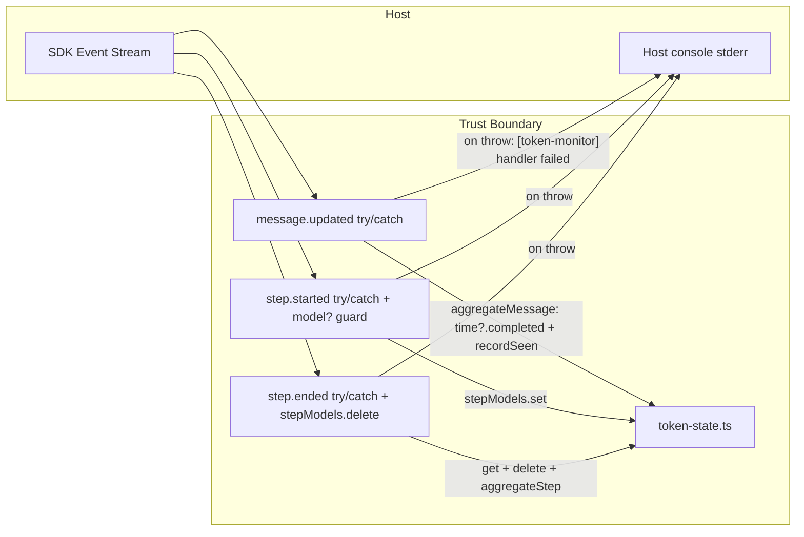

# SPEC: token_monitor_hardening — Defensive Guards for token-monitor TUI Plugin (4 P3 fixes)

> **Status:** Draft
> **Author:** Planner Agent (ba-expert)
> **Date:** 2026-08-07
> **Pattern:** 5-File (SPEC master + RTM/ACM/NFR/DFD companions)
> **Extends:** `plans/SPEC_token_monitor_plugin.md` (**APPROVED** 2026-08-07, port merged on `main` @ `1ad065a`) — parent requirement IDs referenced, not duplicated.
> **Associated Artefacts:** `plans/RTM_token_monitor_hardening.md`, `plans/ACM_token_monitor_hardening.md`, `plans/NFR_token_monitor_hardening.md`, `plans/DFD_token_monitor_hardening.md`

---

## 1. Executive Summary & Business Analysis

### 1.1 Primary Goals & Non-Goals

- **Goals:**
  1. **P3-1 (crash guard):** fix `aggregateMessage` reading `msg.time.completed` unguarded (`token-state.ts:117`) — `msg.time` may be undefined at runtime because the event payload is cast from `event.properties?.info` with **no runtime validation**, while the sdk `v2/types` marks `time` required (schema drift / older API). TypeError inside `message.updated` → plugin event-loop risk. Fix: `msg.time?.completed` (rest of aggregation is already safe: `cost > 0`, `tokens.input > 0` coerce undefined to 0).
  2. **P3-2 (bounded state):** (a) delete the `stepModels` entry in the `session.next.step.ended` handler after read — the map currently grows +1 entry per completed step and is ONLY cleared on dispose; (b) cap the `seen` dedup set at `MAX_SEEN_ENTRIES = 10000` with FIFO eviction of the oldest entry (`recordSeen` helper, O(1) amortized via `seen.delete(seen.values().next().value)`), documented as acceptable loss of "first payload wins" (parent E-016) only for replays older than the eviction window.
  3. **P3-3 (handler isolation):** wrap all 3 event handlers (`message.updated`, `session.next.step.started`, `session.next.step.ended`) in try/catch + non-PII `console.error`, and guard unguarded `p.model.providerID` in `step.started` (`event.properties.model` may be missing). Host emitter isolation is unverified → assume worst (Node-style EventEmitter: listener throw skips later listeners, propagates to uncaught). `console.error` is portable and satisfies R-008 (it is **not** a debug log file).
  4. **P3-4 (test gaps):** add unit tests: (a) 51 distinct models → store keeps ≤50 entries, evicts the LOWEST total-token entry, survivors intact; (b) same modelID under different providers (`openai/claude` vs `anthropic/claude`) → 2 distinct rows (composite `modelKey`); (c) seen-cap FIFO eviction test.
  5. **Mirror:** byte-identically mirror every modified active source + test file into `src/ockit/templates/plugin/token-monitor/` so sync contract R-012 stays zero-drift.
  6. **Verify:** 48 ported vitest tests + 4 integration tests pass verbatim; all 253 ockit pytest stay green; `ockit sync --check` zero drift.

- **Non-Goals:**
  1. **Port-scope discipline (deviation + justification):** the parent SPEC non-goal stated "Do NOT rewrite token-monitor logic; deviation limited to debug strip / import style / dep pins". THIS hardening is justified as **DEFENSIVE GUARDS ONLY** — optional chaining on one read, a bounded dedup helper, one `Map.delete` line, and try/catch wrappers. **Zero change to happy-path semantics** (Constitution Art.9.2 semantic invariance; Art.7.3 graceful degradation). No formatter, aggregation-math, render, dedup-first-payload-wins, ordering, or eviction-strategy change within the cap.
  2. Do NOT change `createTokenStore()` return shape `{ models, seen, getModels, _setModels }` — tests use `seen` directly.
  3. Do NOT change `aggregateMessage` / `aggregateStep` signatures; do NOT change `MAX_MODEL_ENTRIES` (stays 50). Only additive export: `MAX_SEEN_ENTRIES`.
  4. Do NOT modify `index.integration.test.ts` (4 tests stay verbatim).
  5. Do NOT modify `tests/unit/test_token_monitor_manifest.py`, `test_sync.py`, `src/ockit/*.py`, `package.json`, `tsconfig.json`, `vitest.config.ts`, `tui.json`, or the other 4 plugins.
  6. No new dependencies; no network/telemetry; no filesystem writes; no debug log files (console.error is a stderr sink, not a file).

### 1.2 Requirement Traceability Matrix (RTM) (`plans/RTM_token_monitor_hardening.md`)

Full matrix: **7 requirements** `R-001` … `R-007`. Summary:

| Req ID | Business Requirement Description | Source | Priority | Target Component / File | Unit Test Reference | E2E QA Verification | Status |
|--------|----------------------------------|--------|----------|-------------------------|---------------------|---------------------|--------|
| R-001 | Optional-chain guard `msg.time?.completed` in `aggregateMessage` — no TypeError when `time` absent | Review P3-1; extends parent R-013 | P1 | `.opencode/plugin/token-monitor/token-state.ts` | `.opencode/plugin/token-monitor/index.test.ts::createTokenStore + aggregateMessage::skips messages where time is undefined (hardening P3-1)` | `tests/qa-evidence/token-monitor/vitest_pass.log` (regenerate) | Pending |
| R-002 | Delete `stepModels` entry in `step.ended` after read — map bounded to in-flight steps | Review P3-2a; extends parent R-015 | P1 | `.opencode/plugin/token-monitor/index.ts` | `.opencode/plugin/token-monitor/index.integration.test.ts::Token Monitor Plugin Module` (regression) | `tests/qa-evidence/token-monitor/vitest_pass.log` (regenerate) | Pending |
| R-003 | Cap `seen` at `MAX_SEEN_ENTRIES=10000`, FIFO eviction via O(1) amortized `recordSeen` helper | Review P3-2b; extends parent R-013/E-016 | P1 | `.opencode/plugin/token-monitor/token-state.ts` | `.opencode/plugin/token-monitor/index.test.ts::hardening: seen dedup cap` | `tests/qa-evidence/token-monitor/vitest_pass.log` (regenerate) | Pending |
| R-004 | try/catch + non-PII console.error isolation on all 3 handlers; guard `p.model` in step.started | Review P3-3; extends parent R-015/E-018/E-019 | P1 | `.opencode/plugin/token-monitor/index.ts` | `.opencode/plugin/token-monitor/index.integration.test.ts::Token Monitor Plugin Module` (regression) | `tests/qa-evidence/token-monitor/vitest_pass.log` (regenerate) | Pending |
| R-005 | Unit tests: 51-model eviction (≤50, lowest evicted, survivors intact) + composite modelKey distinct rows | Review P3-4a/4b; closes parent ACM E-023/E-029 gap | P1 | `.opencode/plugin/token-monitor/index.test.ts` | `.opencode/plugin/token-monitor/index.test.ts::hardening: MAX_MODEL_ENTRIES eviction` + `::hardening: composite modelKey` | `tests/qa-evidence/token-monitor/vitest_pass.log` (regenerate) | Pending |
| R-006 | Unit test: seen-cap FIFO eviction (evicted-id replay re-counts; in-window dedup intact) | Review P3-4c; extends parent ACM E-016 | P1 | `.opencode/plugin/token-monitor/index.test.ts` | `.opencode/plugin/token-monitor/index.test.ts::hardening: seen dedup cap` | `tests/qa-evidence/token-monitor/vitest_pass.log` (regenerate) | Pending |
| R-007 | Byte-identical mirror of modified files into `src/ockit/templates/plugin/token-monitor/` | Parent R-009/R-012 sync contract | P0 | `src/ockit/templates/plugin/token-monitor/{token-state.ts,index.ts,index.test.ts}` | `tests/unit/test_token_monitor_manifest.py::test_r009_templates_mirror` + `tests/unit/test_sync.py::test_r012_token_monitor_no_drift` | `tests/qa-evidence/token-monitor/sync_check.log` (regenerate) | Pending |

Coverage summary + source reverse index: `plans/RTM_token_monitor_hardening.md`.

### 1.3 Domain Modeling & Ubiquitous Language Glossary

- **Domain Entities (unchanged from parent, plus hardening artifacts):**
  - `AssistantMessage` — opencode v2 assistant message; `time` field is *type-required but runtime-optional* (cast without validation) → hardened read site.
  - `PerModelTotals` — per `providerID/modelID` aggregate row (unchanged).
  - `TokenStore` — `{ models: Record<modelKey, PerModelTotals>, seen: Set<messageID>, getModels(), _setModels }` (shape unchanged; `seen` now capped).
  - `stepModels: Map<assistantMessageID, {providerID, modelID}>` — now bounded to in-flight steps (delete-on-ended).
- **Ubiquitous Language (hardening additions):**
  | Term | Definition & Rules | Implementation Entity / Type |
  |---|---|---|
  | Defensive guard | optional-chaining read that skips (never throws) on missing field | `msg.time?.completed`, `p?.assistantMessageID`, `model?.providerID` |
  | Handler isolation | per-handler try/catch so one failure cannot skip later listeners or crash host | 3 wrapped handlers in `index.ts` |
  | FIFO seen cap | dedup set bounded at 10000; oldest inserted evicted on overflow | `recordSeen(seen, id)` + `MAX_SEEN_ENTRIES` |
  | In-flight step | step with `step.started` received whose `step.ended` has not yet completed | `stepModels` entry lifecycle (set on started, deleted on ended) |
- **User Journey:** unchanged from parent (aggregation + render identical on happy path); only failure paths change — malformed/old payloads are silently skipped or logged one line, never crashing the plugin.

### 1.4 User Stories & Behavioral Acceptance Criteria (BDD / Gherkin Matrix)

#### Story US-01: Plugin Survives Malformed Event Payloads
- **As a** `TUI user with a long-running opencode session`
- **I want to** `not have the token panel (or other plugins) crash when the SDK sends a payload missing time or model`
- **So that** `my session continues even under schema drift or older API versions`

##### Happy Path Scenario (Success Flow)
- **Given** `valid assistant message.updated with tokens + time.completed`
- **When** `handler runs`
- **Then** `tokens aggregate as today; panel unchanged behavior`

##### Fail Path Scenarios
- **Scenario FP-01 (Missing time)**: **Given** `message.updated payload has tokens but time is undefined` **When** `aggregateMessage runs` **Then** `returns false; store unchanged; no TypeError`
- **Scenario FP-02 (Missing model)**: **Given** `session.next.step.started payload lacks event.properties.model` **When** `handler runs` **Then** `returns silently; no stepModels entry; no throw`
- **Scenario FP-03 (Handler throws unexpectedly)**: **Given** `any handler throws mid-execution` **When** `host emitter dispatches` **Then** `one console.error line logged; later listeners + sidebar slot unaffected`
- **Scenario FP-04 (Old replay after cap)**: **Given** `>10000 distinct message ids since a message m0` **When** `m0 replayed` **Then** `re-counted (documented E-016 relaxation); within-window duplicates still dedup`

#### Story US-02: Long Sessions Stay Bounded
- **As a** `plugin operator`
- **I want to** `bounded memory growth for the dedup set and step-model map`
- **So that** `multi-hour sessions don't leak one entry per message/step`

##### Happy Path Scenario (Success Flow)
- **Given** `a session with 100k completed steps`
- **When** `each step.ended is processed`
- **Then** `stepModels holds only in-flight steps; seen ≤ 10000; models ≤ 50`

##### Fail Path Scenarios
- **Scenario FP-01 (Interrupted step)**: **Given** `step.started without matching ended` **When** `session continues` **Then** `entry remains until dispose — bounded by in-flight max; acceptable`
- **Scenario FP-02 (Out-of-order ended)**: **Given** `step.ended for unknown assistantMessageID` **When** `handler runs` **Then** `early return; no crash; no aggregate`
- **Scenario FP-03 (Drift)**: **Given** `active file modified without mirroring` **When** `ockit sync --check runs` **Then** `drift reported; test_r009_templates_mirror fails`

---

## 2. Architecture & Data Flow Diagram (DFD) (`plans/DFD_token_monitor_hardening.md`)

Delta DFD over parent — full diagrams in companion. Core change:

- **Main Data Flow (delta):** every SDK event now enters a try/catch-isolated handler; `aggregateMessage` reads `time?.completed` (never throws on missing), records dedup via capped `recordSeen`; `step.started` stores model only when present; `step.ended` deletes its map entry after aggregation (post-read, entry not needed once the step is done); any residual failure becomes one non-PII console.error line.
- **Trust Boundaries (delta):** TB-2 (SDK events) controls strengthened; TB-5 (error sink) added — see `plans/DFD_token_monitor_hardening.md` §4.

---

## 3. Interface & Schema Specification (Zod & Pydantic)

### API Endpoints

| Method | Path | Request Body | Response Schema | Status Codes |
|--------|------|-------------|-----------------|--------------|
| TUI | `.opencode/tui.json` → `./plugin/token-monitor` | `TuiPluginModule { id?, tui }` | `TuiPluginApi` (slots/event/lifecycle) | Load OK / Load fail |

No HTTP endpoints; no public API change.

### Module Contract (no-API-break)

| Surface | Parent contract | Hardening change |
|---------|-----------------|------------------|
| `createTokenStore()` return | `{ models, seen, getModels, _setModels }` | **Unchanged** (tests use `seen` directly) |
| `aggregateMessage(store, msg)` | `boolean` | **Signature unchanged**; `time?.completed` guard + `recordSeen` |
| `aggregateStep(store, step, model)` | `boolean` | **Signature unchanged**; `recordSeen` |
| `MAX_MODEL_ENTRIES` | `50` | **Unchanged** |
| `MAX_SEEN_ENTRIES` | — | **New additive export** `10000` (used by hardening tests) |
| `recordSeen` | — | New module-private helper (NOT exported) |
| `modelKey`, `totalTokens`, `PerModelTotals`, `StepTokenUsage` | unchanged | **Unchanged** |

### Zod / Pydantic Data Validation Schemas

No new I/O schema. Runtime defensiveness (per Constitution Art.7.3) replaces validation: `msg.time?.completed`, `p?.assistantMessageID`, `model?.providerID`, `model?.id`. A future config Zod schema remains out of scope (parent recommendation, unchanged).

---

## 4. Non-Functional Requirements (NFR) (`plans/NFR_token_monitor_hardening.md`)

| Category | Target Metric / Floor Threshold | Verification Method |
|----------|--------------------------------|---------------------|
| Reliability | 0 crashes in any of 3 handlers on malformed payloads | hardening tests + 4 integration regression |
| Memory bounded | `seen` ≤ 10,000; `stepModels` ≤ in-flight steps; `models` ≤ 50 | seen-cap test + eviction test + code review |
| Performance | per-event O(1) amortized incl. FIFO eviction; no new loops | code review + vitest suite runtime |
| Compatibility | 48 + 4 tests verbatim; public API unchanged; `pytest` 253 green | `npm --prefix .opencode test` + `tsc --noEmit` + `pytest tests/ -q` |
| Portability | console.error only new sink; no `/tmp`/debug files; R-008/R-017 green | `test_r008_no_debug_log` + `test_r017_no_leaks` |
| Maintainability | zero sync drift after mirror | `test_sync.py::test_r012_token_monitor_no_drift` |

Full NFR table + budgets + floors: `plans/NFR_token_monitor_hardening.md`.

---

## 5. File Mutation Manifest

| Action | File Path | Rationale & Responsibility |
|--------|-----------|----------------------------|
| Modify | `.opencode/plugin/token-monitor/token-state.ts` | R-001 (`time?.completed`), R-003 (`MAX_SEEN_ENTRIES` + `recordSeen` + call sites) |
| Modify | `.opencode/plugin/token-monitor/index.ts` | R-002 (`stepModels.delete` in ended), R-004 (try/catch ×3 + `p.model` guard) |
| Modify | `.opencode/plugin/token-monitor/index.test.ts` | R-005/R-006 — **append-only** new hardening describes/its; existing 48 tests untouched |
| Modify | `src/ockit/templates/plugin/token-monitor/token-state.ts` | R-007 mirror (byte-identical to active) |
| Modify | `src/ockit/templates/plugin/token-monitor/index.ts` | R-007 mirror (byte-identical to active) |
| Modify | `src/ockit/templates/plugin/token-monitor/index.test.ts` | R-007 mirror (byte-identical to active) |
| Create | `plans/SPEC_token_monitor_hardening.md` | This SPEC |
| Create | `plans/RTM_token_monitor_hardening.md` | RTM companion |
| Create | `plans/ACM_token_monitor_hardening.md` | 12-Dimensional Edge Case companion |
| Create | `plans/NFR_token_monitor_hardening.md` | NFR companion |
| Create | `plans/DFD_token_monitor_hardening.md` | DFD companion |

> **Constraint:** Subagents MUST NOT create or modify files outside this manifest. `index.integration.test.ts`, `tests/unit/test_token_monitor_manifest.py`, `test_sync.py`, `src/ockit/*.py`, `package.json`, `tsconfig.json`, `vitest.config.ts`, `tui.json` are NOT in scope. Test mirroring is REQUIRED: `test_r009_templates_mirror`'s `PLUGIN_FILES = CORE_FILES + PORTED_TESTS` includes `index.test.ts` (verified), so any modification to the active test file MUST be mirrored byte-identically.

---

## 6. Test Plan & 12-Dimensional Edge Case Matrix (ACM) (`plans/ACM_token_monitor_hardening.md`)

### 6.1 Unit / Integration Tests (Given-When-Then)

- **Given** `aggregateMessage(store, makeMsg({ time: undefined }))` **When** `run` **Then** `returns false; store empty; no throw` (R-001).
- **Given** 49 high-token models + `lowest` (1 token) + 51st model `extra` **When** `all aggregated` **Then** `getModels() length == 50; lowest evicted; extra + 49 high survivors intact` (R-005).
- **Given** `openai/claude` and `anthropic/claude` **When** `aggregated` **Then** `2 distinct rows; independent counts` (R-005).
- **Given** `MAX_SEEN_ENTRIES+1` distinct ids on one model **When** `aggregated` **Then** `oldest evicted; replay of evicted id → true; in-window duplicate → false` (R-006).
- **Given** `tui()` with minimal mock api **When** `invoked` **Then** `resolves undefined; slot registered; 3 subscriptions; no throw` (R-004 regression).
- **Given** active modified files **When** `ockit sync --check` / `test_r009_templates_mirror` **Then** `zero drift; byte-identical` (R-007).

### 6.2 12-Dimensional Business Edge Case Matrix (ACM)

Delta matrix (E-001 … E-008) over the parent baseline (E-001 … E-032): `plans/ACM_token_monitor_hardening.md`. Summary:

| Edge ID | Risk Dimension | Test Scenario | Expected Result & Code | Test ID |
|---------|----------------|---------------|------------------------|---------|
| E-001 | 1. Null / Missing | `aggregateMessage` with `time: undefined` | returns false; no TypeError | T-EDGE-H01 |
| E-002 | 1. Null / Missing | `step.started` payload missing `model` | silent skip; no throw | T-EDGE-H02 |
| E-003 | 7. Partial Failure | `message.updated` handler throws | console.error one line; later listeners + slot survive | T-EDGE-H03 |
| E-004 | 10. Resource Leak | 100k completed steps | `stepModels` bounded to in-flight (delete-on-ended) | T-EDGE-H04 |
| E-005 | 10. Resource Leak | interrupted step (no ended) | entry until dispose; bounded; acceptable | T-EDGE-H05 |
| E-006 | 9. Context Overflow | 51 distinct model keys | ≤50 entries; lowest-total evicted; survivors intact | T-EDGE-H06 |
| E-007 | 11. Tenant / Cross-project Leak | `openai/claude` vs `anthropic/claude` | 2 distinct rows (composite modelKey) | T-EDGE-H07 |
| E-008 | 6. Idempotency | seen cap exceeded; evicted-id replay | re-count (E-016 relaxation); in-window dedup intact | T-EDGE-H08 |

All 12 dimensions covered: dims 2,3,4,5,8,12 remain on parent baseline edges (untouched code paths) enforced by the 48 ported + 4 integration tests — see coverage checklist in `plans/ACM_token_monitor_hardening.md`.

---

## 7. Backward Compatibility & Security Audit

- [x] OWASP-AI-01 Slopsquatting scanned: **zero new dependencies**; no hallucinated packages.
- [x] OWASP-AI-02 IDOR authorization: no data access layer; store in-memory per plugin instance.
- [x] OWASP-AI-03 Input sanitization: SDK payloads defensively guarded (`time?.completed`, `model?.`, try/catch); no eval/shell/raw SQL.
- [x] OWASP-AI-04 Hardcoded secrets scan: no secrets; console.error logs error message only (never payload/PII); R-008 debug-log strip stays green.
- [x] OWASP-AI-05 Excessive agency & path sandboxing: no file writes, no shell, no network; only stderr console sink added.
- **Backward compatibility (no-API-break contract — implementation MUST NOT change):**
  1. `createTokenStore()` return shape `{ models, seen, getModels, _setModels }` — unchanged; tests read `seen` directly.
  2. `aggregateMessage` / `aggregateStep` signatures + return semantics — unchanged.
  3. `MAX_MODEL_ENTRIES = 50` — unchanged; eviction strategy (min-total-token among current entries, evict BEFORE inserting new key) — unchanged.
  4. First-payload-wins dedup within the cap — unchanged; relaxed ONLY beyond `MAX_SEEN_ENTRIES` (documented, E-016).
  5. No new runtime deps; no package.json/tsconfig/vitest/tui.json changes; existing 4 plugins + Python CLI untouched.
  6. `index.integration.test.ts` — untouched, 4 tests verbatim.

---

## 8. Definition of Done & 3-State Verification

- [ ] All RTM (`R-001` … `R-007`) requirements mapped 1:1 to passing tests (48 ported + 4 integration + 4 new hardening vitest; pytest manifest gates)
- [ ] 12-Dimensional Edge Case Matrix (ACM hardening E-001 … E-008 + parent baseline) covered in test suite
- [ ] Non-Functional Requirements (NFR) validated against quality floors
- [ ] Data Flow Diagram (DFD) trust boundaries verified (TB-2 strengthened, TB-5 added)
- [ ] 3-State Verification audit completed (`Pending` → `Confirmed` on all claims)
- [ ] Stamped `plan-review` approval recorded
- [ ] `npm --prefix .opencode test` green (48 ported + 4 integration + new hardening tests)
- [ ] `npm --prefix .opencode run type-check` green (tsc --noEmit)
- [ ] `pytest tests/ -q` green (253 existing + manifest/sync gates)
- [ ] `ockit sync --check` zero drift for token-monitor files (active == templates byte-identical)
- [ ] `ockit verify` passed cleanly
- [ ] Conventional Commits recorded (e.g. `fix(plugin): harden token-monitor handlers and bound state`)

---

## Open Questions & Assumptions (resolved during planning)

1. **Mirror contract for test files — RESOLVED:** `test_r009_templates_mirror` (`tests/unit/test_token_monitor_manifest.py`) defines `PLUGIN_FILES = CORE_FILES + PORTED_TESTS`, so `index.test.ts` AND `index.integration.test.ts` ARE mirrored into `src/ockit/templates/plugin/token-monitor/` (verified: template copies byte-identical, same sizes). Therefore the modified active `index.test.ts` MUST be mirrored byte-identically too (R-007). `index.integration.test.ts` is not modified, so its mirror requires no action.
2. **Parent ACM coverage gap — CONFIRMED:** parent ACM E-023 (51-model eviction) and E-029 (composite provider/model key) claim coverage under "index.test.ts (ported, verbatim)", but NO such tests exist in the actual file (P3-4 finding). Hardening R-005 closes this gap with explicit tests. No parent artefact is regenerated (parent SPEC header forbids regeneration without user approval).
3. **stepModels map-bounding is statically verified:** the shared `seen` dedup masks the map-delete in black-box tests (a replayed ended for a deleted entry produces the same observable result as a retained entry). R-002 is therefore verified by code review + integration regression, not a dedicated unit test — documented in `plans/ACM_token_monitor_hardening.md` §Test ID mapping.
4. **Handler throw-path tests:** per the user's explicit file list (`token-state.ts`, `index.ts`, `index.test.ts`), `index.integration.test.ts` stays verbatim; the try/catch isolation is verified by code review + the existing minimal-mock-api integration regression (E-018/E-019 style). No mock-dispatch enhancement added.
5. **Eviction order confirmed by code reading:** `addTokensToModel` evicts the min-total entry among the CURRENT entries BEFORE inserting the new key (so the 51st key survives and the lowest of the first 50 is evicted). The 51-model test in R-005 is specified to match this behavior.
6. **console.error vs R-008:** `test_r008_no_debug_log` forbids only `appendFileSync`, `TOKEN_MONITOR_DEBUG`, `token-monitor-debug.log`, `/tmp/`. `console.error` to stderr is not a debug log file and does not trip the gate; no new forbidden patterns are introduced (verified against `_FORBIDDEN_PATTERNS`).
7. **`MAX_SEEN_ENTRIES` export:** exported as an additive module const so the seen-cap test can reference it; `recordSeen` remains module-private. No API break.
