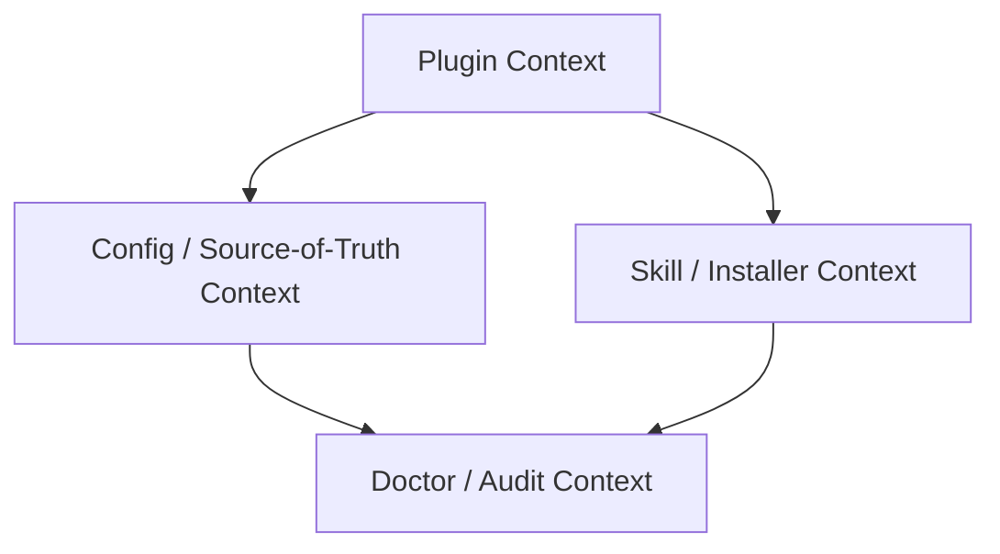
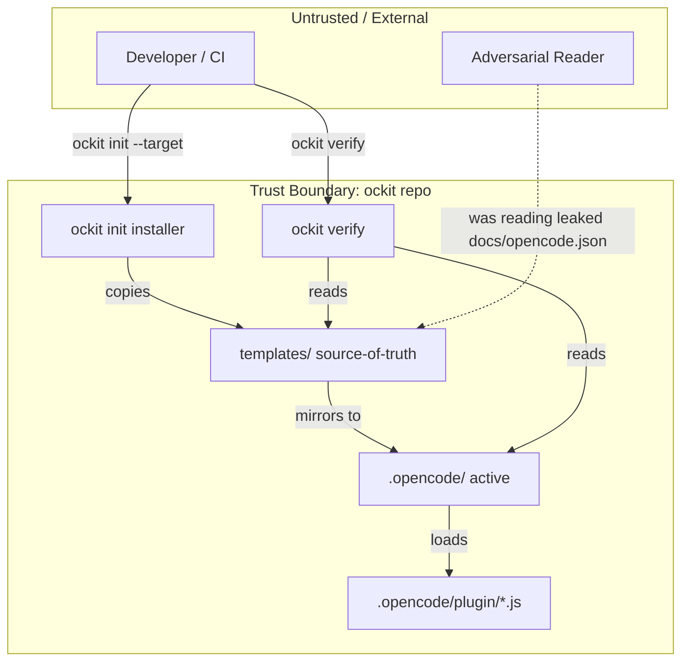
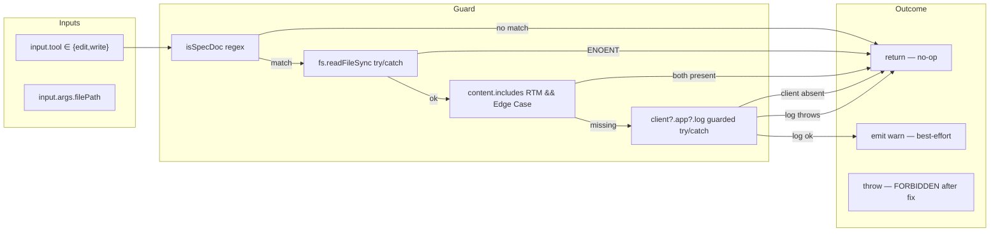
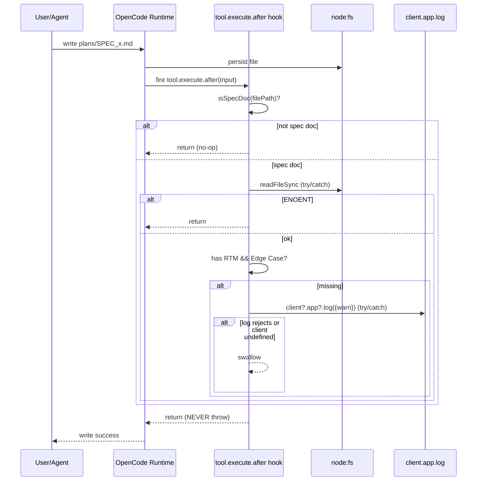

# SPEC: top3_risk_fixes — Resolve Top-3 Risk Issues (§16 ISSUE-01/03/04)

> **Status:** Draft
> **Author:** Planner Agent (ba-expert)
> **Date:** 2026-08-07
> **Pattern:** 1-File (inline RTM + ACM + NFR + DFD)
> **Source Brief:** `docs/ockit_workflow_and_feature.html` §16 (Risk top-3)
> **Baseline (must not regress):** `pytest tests/ -q` → 227 passed · `ockit verify` → 0 errors / 0 warnings

---

## 1. Executive Summary & Business Analysis

### 1.1 Primary Goals & Non-Goals

**Goals:**
- **ISSUE-01 (HIGH):** Harden `.opencode/plugin/ockit-ba-traceability.js` so the `tool.execute.after` hook can NEVER break the OpenCode tool chain — wrap the `client.app.log(...)` side-effect in a null-guard + try/catch (Constitution Art.7.3 Graceful Degradation; Art.7.4 no unguarded side-effect calls). Add a plugin smoke test asserting all 4 plugins export a valid async factory + non-throwing hook behaviour (ISSUE-08 recommendation).
- **ISSUE-03 (MED):** Delete `docs/opencode.json` — a leaked personal config (provider pins `zai`/`opencode-go`/`deepseek`/`mimo`/`xai`, machine-specific MCP servers, third-party plugins) that diverges from the single portable source of truth `src/ockit/templates/opencode.json` and violates `AGENTS.md §2`.
- **ISSUE-04 (LOW):** Stop shipping the 2 demo skills (`example-skill`, `test-skill`) into target projects — relocate to `tests/fixtures/skills/`, remove from active `.opencode/skill/` so `ockit doctor` reports exactly 10 production skills and `ockit sync` reports zero drift for those paths.

**Non-Goals (explicitly EXCLUDED):**
- ISSUE-02 (orchestrator "11-stage" vs 10-states doc typo) — doc-only, deferred.
- ISSUE-05 (installer `node_modules` exclusion) — separate installer hardening track.
- ISSUE-06 (`worktree.py` not wired to CLI) — feature gap, separate SPEC.
- ISSUE-07 (`scan_deps` package.json false-positive fields) — scanner tuning, separate SPEC.
- ISSUE-08 broader scope — ONLY the plugin smoke-test recommendation feeding ISSUE-01 is in scope; other ISSUE-08 items deferred.
- ISSUE-09 (safe-pipeline step numbering) — doc-only.
- ISSUE-10 (`doctor` `node_installed` not printed) — cosmetic.
- ISSUE-11 (`verify` traceability format) — covered by current verify contract; no change.
- ISSUE-12 (skill content marker coverage) — ba-qa suite already enforces markers for the 4 mandatory skills.

### 1.2 Requirement Traceability Matrix (RTM)

| Req ID | Business Requirement Description | Source | Priority | Target Component / File | Unit Test Reference | E2E QA Verification | Status |
|--------|----------------------------------|--------|----------|-------------------------|---------------------|---------------------|--------|
| R-001 | BA-traceability plugin MUST NOT throw when `client.app.log` is unavailable or rejects — guard with `if (client?.app?.log)` + try/catch swallow (logging is best-effort) | §16 ISSUE-01 / Art.7.3 | P0 | `.opencode/plugin/ockit-ba-traceability.js` | `tests/unit/test_plugin_smoke.py::test_r001_ba_traceability_no_throw_without_client` | `tests/qa-evidence/top3/r001_hook_no_throw.log` | Pending |
| R-002 | A plugin smoke test MUST assert each of the 4 plugins exports an async factory returning the documented hook shape AND does not throw on a spec-doc input lacking RTM/Edge Case markers | §16 ISSUE-01 + ISSUE-08 | P0 | `tests/unit/test_plugin_smoke.py` | `tests/unit/test_plugin_smoke.py::test_r002_all_plugins_export_valid_hook_shape` | `tests/qa-evidence/top3/r002_smoke_all4.log` | Pending |
| R-003 | Packaged plugin mirror `src/ockit/templates/plugin/ockit-ba-traceability.js` MUST stay byte-identical to active `.opencode/plugin/ockit-ba-traceability.js` (ockit sync invariant; applies to all 4 plugins) | AGENTS.md §2 / sync invariant | P0 | `src/ockit/templates/plugin/ockit-ba-traceability.js` | `tests/unit/test_sync.py::test_r003_ba_traceability_active_equals_template` | `tests/qa-evidence/top3/r003_plugin_mirror.log` | Pending |
| R-004 | `docs/opencode.json` MUST be removed — no personal provider/MCP/plugin pins in the repo outside the portable shipped template | §16 ISSUE-03 / AGENTS.md §2 | P1 | `docs/opencode.json` (DELETE) | `tests/unit/test_no_leaked_config.py::test_r004_docs_opencode_json_removed` | `tests/qa-evidence/top3/r004_no_leak.log` | Pending |
| R-005 | `example-skill` and `test-skill` MUST NOT ship into target projects — removed from `src/ockit/templates/skill/` (installer `_plan_files` no longer copies them) | §16 ISSUE-04 | P1 | `src/ockit/templates/skill/example-skill/`, `src/ockit/templates/skill/test-skill/` (DELETE) | `tests/unit/test_installer_skill_exclusion.py::test_r005_demo_skills_not_in_plan` | `tests/qa-evidence/top3/r005_no_demo_ship.log` | Pending |
| R-006 | Demo skill content MUST be preserved under `tests/fixtures/skills/` for fixture use (relocate, not discard) | §16 ISSUE-04 preferred fix | P1 | `tests/fixtures/skills/example-skill/SKILL.md`, `tests/fixtures/skills/test-skill/SKILL.md` (CREATE) | `tests/unit/test_installer_skill_exclusion.py::test_r006_demo_skills_preserved_in_fixtures` | `tests/qa-evidence/top3/r006_fixtures_present.log` | Pending |
| R-007 | `example-skill`/`test-skill` removed from active `.opencode/skill/` so `ockit doctor` reports exactly 10 production skills and `ockit sync` reports zero drift for those paths | §16 ISSUE-04 / doctor.py:200 `expected_skills` | P1 | `.opencode/skill/example-skill/`, `.opencode/skill/test-skill/` (DELETE) | `tests/unit/test_doctor_skills.py::test_r007_doctor_reports_exactly_ten_skills` | `tests/qa-evidence/top3/r007_doctor_ten.log` | Pending |
| R-008 | `ockit verify` MUST remain at 0 errors / 0 warnings after all fixes (no regression to traceability/ba-qa/agents/commands suites) | Baseline contract | P1 | `src/ockit/verify.py` (no code change; regression guard) | `tests/unit/test_verify_exit_contract.py::test_r008_verify_clean_after_fixes` | `tests/qa-evidence/top3/r008_verify_clean.log` | Pending |
| R-009 | All 227 existing tests MUST continue to pass (zero regression on installer/sync/doctor/verify/portable_config) | Baseline 227-passed | P0 | full `tests/` tree | `pytest tests/ -q` (full-suite regression harness) | `tests/qa-evidence/top3/regression_227.log` | Pending |
| R-010 | `docs/ockit_workflow_and_feature.html` §16 ISSUE-01/03/04 entries MUST be updated to mark them RESOLVED with the fix applied + date | Doc-traceability | P2 | `docs/ockit_workflow_and_feature.html` (MODIFY) | `tests/unit/test_html_doc_updated.py::test_r010_issue_entries_marked_resolved` | `tests/qa-evidence/top3/html_updated.diff` | Pending |

**Coverage Summary**

| Priority | Count | IDs |
|----------|------:|-----|
| P0 | 4 | R-001, R-002, R-003, R-009 |
| P1 | 5 | R-004, R-005, R-006, R-007, R-008 |
| P2 | 1 | R-010 |
| **Total** | **10** | R-001 … R-010 |

> **Test-file creation flag (for coder TDD phase):** Files `test_plugin_smoke.py`, `test_no_leaked_config.py`, `test_installer_skill_exclusion.py`, `test_doctor_skills.py`, `test_verify_exit_contract.py`, `test_html_doc_updated.py` are NEW (do not yet exist in `tests/unit/`). The R-003 assertion `test_r003_ba_traceability_active_equals_template` is a NEW case to ADD to the existing `tests/unit/test_sync.py`. All other referenced tests already exist. Coder creates these first (RED), then implements (GREEN).

### 1.3 Domain Modeling & Ubiquitous Language Glossary

**Domain Entities (Bounded Contexts):**

| Entity | Fields | Context |
|---|---|---|
| `PluginFactory` | `async ({ client }) => ({ "<hook>": async (input) => {} })` | Plugin Context |
| `PluginHookInput` | `{ tool: "edit"\|"write", args: { filePath?: string } }` | Plugin Context |
| `PortableConfig` | `$schema, lsp, autoupdate, share, agent, permission, plugin[]` | Config/Source-of-Truth Context |
| `SkillEntry` | `name, SKILL.md body, packaged:boolean` | Skill/Installer Context |
| `DoctorSkillInventory` | `expected_skills[10], skills_valid:bool, missing_skills[]` | Doctor/Audit Context |

**Ubiquitous Language Glossary:**

| Term | Definition | Implementation Entity |
|---|---|---|
| Plugin Hook Signature | Contract shape a plugin factory must export: `async ({ client }) => ({ "<hook>": async (input) => {} })` | `.opencode/plugin/*.js` export |
| BA Traceability Guard | After-hook warning when a spec doc lacks `RTM` or `Edge Case` strings | `ockit-ba-traceability.js:40` |
| Portable Config | Shipped `opencode.json` with zero personal pins — env-var placeholders only | `src/ockit/templates/opencode.json` |
| Source of Truth (Config) | Single canonical config = packaged template; `docs/` must not diverge | `AGENTS.md §2` |
| Demo Skill | Non-production skill (example/test) for fixture use, must NOT ship to target | `tests/fixtures/skills/` |
| Plugin Smoke Test | Test that loads a plugin module and asserts its exported hook shape + non-throwing behaviour | `tests/unit/test_plugin_smoke.py` |
| Sync Mirror Invariant | Active `.opencode/<x>` byte-identical to `src/ockit/templates/<x>` | `ockit sync` |

**Actors & User Journey:**
- **Developer** → runs `ockit init --target proj` → installer copies templates → plugins/skills load in OpenCode runtime.
- **CI** → runs `ockit verify` + `pytest tests/ -q` → gates merge.
- **OpenCode runtime** → loads `.opencode/plugin/*.js` → fires `tool.execute.after` hooks on every edit/write.
- **Adversarial actor** → reads leaked `docs/opencode.json` → harvests provider baseURLs / MCP endpoints; or loads noisy `example-skill` → wastes agent context.

**Bounded Contexts Map:**



### 1.4 User Stories & Behavioral Acceptance Criteria (BDD / Gherkin Matrix)

#### Story US-01: Tool chain survives a broken logger (ISSUE-01)
- **As an** OpenCode runtime user
- **I want** the BA-traceability plugin to never crash the tool chain
- **So that** every edit/write to a spec doc completes even if `client.app.log` is missing or throws.

##### Happy Path
- **Given** a spec doc `plans/SPEC_x.md` written that lacks `RTM`/`Edge Case` markers, and a fully-wired `client.app.log`
- **When** the `tool.execute.after` hook fires
- **Then** a `warn` log is emitted (best-effort) and the write completes (no throw).

##### Fail Paths
- **FP-01 (client undefined):** **Given** `client` is `undefined` **When** hook fires **Then** null-guard `client?.app?.log` short-circuits, no throw, exit 0.
- **FP-02 (client.app.log rejects):** **Given** `client.app.log` returns a rejected promise **When** hook fires **Then** try/catch swallows, no throw, tool chain proceeds.
- **FP-03 (non-spec doc):** **Given** `input.tool == "edit"` but `filePath = "README.md"` (not a spec doc) **When** hook fires **Then** early-return, no read, no log.

#### Story US-02: Repo carries no personal config leak (ISSUE-03)
- **As a** repo consumer
- **I want** zero personal provider/MCP/plugin pins outside the portable template
- **So that** the shipped config is machine-agnostic.

##### Happy Path
- **Given** `docs/opencode.json` deleted
- **When** CI scans repo for personal config leaks
- **Then** only `src/ockit/templates/opencode.json` (= `.opencode/opencode.json`) exists, both byte-identical and portable.

##### Fail Paths
- **FP-01 (leak reintroduced):** **Given** a new `docs/opencode.json` appears **When** `test_r004_docs_opencode_json_removed` runs **Then** FAIL with What/Context/Fix error.
- **FP-02 (personal home path):** **Given** any shipped config contains `/Users/` **When** `test_portable_config.py::test_no_home_paths` runs **Then** FAIL.

#### Story US-03: Demo skills never ship to target (ISSUE-04)
- **As a** target-project developer
- **I want** only the 10 production skills in my `.opencode/skill/`
- **So that** agents do not load `example-skill`/`test-skill` noise by mistake.

##### Happy Path
- **Given** demo skills relocated to `tests/fixtures/skills/` and removed from templates + active
- **When** `ockit init --target proj` runs
- **Then** `proj/.opencode/skill/` contains exactly the 10 production skills, zero demos.

##### Fail Paths
- **FP-01 (demo still in plan):** **Given** `src/ockit/templates/skill/example-skill/SKILL.md` exists **When** `installer._plan_files()` runs **Then** FAIL — demo appears in copy plan.
- **FP-02 (doctor over-reports):** **Given** `.opencode/skill/example-skill/` still present **When** `ockit doctor` runs **Then** reports 12 skills, not 10.
- **FP-03 (fixture lost):** **Given** `tests/fixtures/skills/test-skill/SKILL.md` missing **When** `test_r006_demo_skills_preserved_in_fixtures` runs **Then** FAIL.

---

## 2. Architecture & Data Flow Diagram (DFD)

### Context Diagram (L0)



### Command Flow (L1) — ISSUE-01 plugin hook hardening



### Sequence — Critical Flow: write spec doc → BA-traceability hook



### Trust Boundaries

| Boundary | Inside (trusted) | Outside (untrusted) | Controls |
|----------|------------------|---------------------|----------|
| TB-1 Plugin Hook | `.opencode/plugin/*.js` body | OpenCode runtime variance (client shape) | null-guard `client?.app?.log` + try/catch swallow (R-001) |
| TB-2 Config Source of Truth | `src/ockit/templates/opencode.json` | `docs/`, personal machines | delete `docs/opencode.json`; portable_config test gate (R-004) |
| TB-3 Template Ship Surface | `src/ockit/templates/skill/*` (10 production) | target projects | installer excludes demo skills; doctor `expected_skills` gate (R-005/R-007) |
| TB-4 Audit Inputs | `ockit verify` reads plans/ + templates/ + active/ | SPEC authoring | traceability + ba-qa suite contract (R-008) |

### Main Data Flows (narrative)
1. **Plugin hardening flow:** write/edit spec doc → runtime fires `tool.execute.after` → hook checks `isSpecDoc` → reads file (try/catch) → if missing RTM/Edge Case → guarded `client?.app?.log` warn (try/catch swallow) → returns regardless. Crash path eliminated.
2. **Config de-leak flow:** repo scan → `docs/opencode.json` removed → only portable template remains → `test_portable_config.py` + new `test_no_leaked_config.py` enforce single source of truth.
3. **Demo-skill relocation flow:** `src/ockit/templates/skill/{example,test}-skill/` moved to `tests/fixtures/skills/` → active `.opencode/skill/{example,test}-skill/` deleted → installer `_plan_files` no longer sees them → `ockit doctor` reports 10 → `ockit sync` reports zero drift for those paths.

### Data Stores & Sensitivity

| Store | Sensitivity | Read by | Write by |
|-------|-------------|---------|----------|
| `.opencode/plugin/*.js` | High (tool-chain integrity) | OpenCode runtime, smoke test | coder (R-001/R-003) |
| `src/ockit/templates/opencode.json` | High (portable source of truth) | installer, verify, portable_config test | coder only |
| `docs/opencode.json` | FORBIDDEN (personal leak) | — | DELETED (R-004) |
| `tests/fixtures/skills/*` | Low (test fixture) | test_installer_skill_exclusion | coder (R-006) |

### Threat → Control Trace

| Threat | DFD element | Control | Req |
|--------|-------------|---------|-----|
| Runtime variance → `client` undefined → hook throws → tool chain dies | TB-1 | null-guard + try/catch swallow | R-001 |
| Personal config harvested from `docs/` | TB-2 | delete `docs/opencode.json` + leak test | R-004 |
| Demo skill loaded by agent in target project | TB-3 | relocate + doctor `expected_skills` gate | R-005/R-007 |
| Plugin mirror drift → shipped ≠ active | TB-1 | sync invariant test (active == template) | R-003 |

---

## 3. Interface & Schema Specification (Zod & Pydantic)

### API Endpoints

This feature has no HTTP API. All surfaces are CLI / filesystem / ESM module export.

| Method | Path | Request Body | Response Schema | Status Codes |
|--------|------|-------------|-----------------|--------------|
| CLI | `ockit init --target <dir> [--force] [--dry-run]` | argv | `{status, target_dir, opencode_dir, copied_files[], skipped_files[]}` | 0 (success), 1 (unsafe target / missing templates) |
| CLI | `ockit doctor` | — | `{git_installed, agents_valid, skills_valid, errors[], warnings[]}` | 0 (ok), 1 (errors) |
| CLI | `ockit verify` | — | `{suite, findings[], error_count, warning_count, exit_code}` | 0 (no errors), 1 (any FAIL) |
| ESM | `import('.opencode/plugin/ockit-ba-traceability.js')` | — | `{ OckitBaTraceability: async ({client}) => ({ "tool.execute.after": async (input) => {} }) }` | module load 0 / throw on malformed |

### Zod / Pydantic Data Validation Schemas

**TypeScript Zod (plugin hook input — runtime guard, not imported, documents the contract):**

```typescript
import { z } from "zod";

// Plugin hook input contract (ba-traceability.js consumes this)
export const PluginHookInputSchema = z.object({
  tool: z.enum(["edit", "write", "bash", "read", "glob", "grep"]).catchAll(z.unknown()),
  args: z.object({
    filePath: z.string().optional(),
    file_path: z.string().optional(),
    path: z.string().optional(),
  }).passthrough().optional(),
}).passthrough();

// Factory export contract
export const PluginFactoryOutputSchema = z.object({
  "tool.execute.after": z.function().optional(),
  "tool.execute.before": z.function().optional(),
  tool: z.record(z.unknown()).optional(),
}).passthrough();
```

**Python Pydantic (test-side assertion model — used by `test_plugin_smoke.py` to validate hook shape via subprocess JSON output):**

```python
from pydantic import BaseModel, Field
from typing import Any, Callable, Optional

class PluginHookInput(BaseModel):
    tool: str
    args: dict[str, Any] = Field(default_factory=dict)

    class Config:
        extra = "allow"

class PluginFactoryOutput(BaseModel):
    """Shape every ockit plugin factory MUST return."""
    model_config = {"extra": "allow"}
    tool_execute_after: Optional[Callable] = Field(default=None, alias="tool.execute.after")
    tool_execute_before: Optional[Callable] = Field(default=None, alias="tool.execute.before")
```

---

## 4. Non-Functional Requirements (NFR)

| NFR ID | Category | Target Metric / Floor Threshold | Verification Method | Related Req |
|--------|----------|--------------------------------|---------------------|-------------|
| NFR-001 | Reliability | Plugin hook throw rate = 0 across {client undefined, log rejects, ENOENT, non-spec doc, missing markers} | smoke test x5 scenarios | R-001 |
| NFR-002 | Coverage Floor | ≥ 85% lines on changed plugin + new test files | `pytest --cov` after TDD | R-002 |
| NFR-003 | Portability | 0 personal home paths / 0 literal apiKeys / 0 machine-specific MCP/plugin pins in shipped artifacts | `test_portable_config.py` + `test_no_leaked_config.py` grep gate | R-004 |
| NFR-004 | Idempotency | `ockit init` run N times → identical `.opencode/` tree (no demo skills ever) | `diff -qr` across 2 runs | R-005 |
| NFR-005 | Maintainability | `ockit doctor` reports exactly 10 production skills (deterministic inventory) | doctor skills test | R-007 |
| NFR-006 | Error Clarity | Every non-zero exit / thrown error includes 3-part: What / Context / Fix | unit assert on message shape | Constitution Art.3 |
| NFR-007 | Latency (p95) | `ockit verify` < 5 s local on this repo | `time .venv/bin/ockit verify` | R-008 |
| NFR-008 | Compatibility | Zero new runtime deps (stay within stdlib + `jsonschema`) | `pyproject.toml` diff empty for deps | AGENTS.md §2 |
| NFR-009 | Security | `docs/opencode.json` absent from repo HEAD | `git ls-files docs/opencode.json` returns empty | R-004 |

**Quality Floors**

| Metric | Floor |
|--------|------:|
| Existing test suite | 227 passed (zero regression) |
| `ockit verify` | 0 errors, 0 warnings |
| Portable path violations | 0 |
| Hardcoded secrets in shipped artifacts | 0 |
| Demo skills in shipped templates | 0 |

---

## 5. File Mutation Manifest

| Action | File Path | Rationale & Responsibility |
|--------|-----------|----------------------------|
| Modify | `.opencode/plugin/ockit-ba-traceability.js` | R-001: wrap `client.app.log(...)` (line 41) in `if (client?.app?.log) { try { await ... } catch {} }`. Keep existing `readFileSync` try/catch. |
| Modify | `src/ockit/templates/plugin/ockit-ba-traceability.js` | R-003: mirror identical change byte-for-byte (sync invariant). |
| Delete | `docs/opencode.json` | R-004: leaked personal config (provider/MCP/plugin pins) — single source of truth is the shipped template. |
| Delete | `src/ockit/templates/skill/example-skill/SKILL.md` (+ dir) | R-005: stop shipping demo skill to targets. |
| Delete | `src/ockit/templates/skill/test-skill/SKILL.md` (+ dir) | R-005: stop shipping demo skill to targets. |
| Delete | `.opencode/skill/example-skill/SKILL.md` (+ dir) | R-007: active copy removed — doctor reports 10, sync zero drift. |
| Delete | `.opencode/skill/test-skill/SKILL.md` (+ dir) | R-007: active copy removed. |
| Create | `tests/fixtures/skills/example-skill/SKILL.md` | R-006: preserve demo content as test fixture (relocated, not discarded). |
| Create | `tests/fixtures/skills/test-skill/SKILL.md` | R-006: preserve demo content as test fixture. |
| Create | `tests/unit/test_plugin_smoke.py` | R-001/R-002: smoke test for all 4 plugins (ESM import via `node` subprocess from pytest). |
| Create | `tests/unit/test_installer_skill_exclusion.py` | R-005/R-006: installer plan excludes demos; fixtures present. |
| Create | `tests/unit/test_no_leaked_config.py` | R-004: `docs/opencode.json` absent from repo. |
| Create | `tests/unit/test_doctor_skills.py` | R-007: doctor reports exactly 10 production skills. |
| Create | `tests/unit/test_verify_exit_contract.py` | R-008: `ockit verify` clean after fixes. |
| Create | `tests/unit/test_html_doc_updated.py` | R-010: HTML §16 ISSUE-01/03/04 marked RESOLVED. |
| Modify | `tests/unit/test_sync.py` | R-003: ADD case `test_r003_ba_traceability_active_equals_template` (assert active==template bytes for the 4 plugins). |
| Modify | `docs/ockit_workflow_and_feature.html` | R-010: mark ISSUE-01/03/04 RESOLVED with date 2026-08-07. |

> **Constraint:** Subagents MUST NOT create or modify files outside this manifest. No new runtime dependencies. All new tests are pytest (Python) invoking `node` via `subprocess` where JS ESM import is required.

---

## 6. Test Plan & 12-Dimensional Edge Case Matrix (ACM)

### 6.1 Unit / Integration Tests (Given-When-Then)

- **Given** `client = undefined` **When** `OckitBaTraceability({client})` hook fires on a spec doc missing markers **Then** no throw (R-001). `tests/unit/test_plugin_smoke.py::test_r001_ba_traceability_no_throw_without_client`.
- **Given** each of the 4 plugins **When** dynamically imported via `node -e "import(...).then(...)"` **Then** factory is async and returns an object with ≥1 documented hook key, and the ba-traceability hook does not throw on `input={tool:"write", args:{filePath:"plans/SPEC_x.md"}}` (R-002). `tests/unit/test_plugin_smoke.py::test_r002_all_plugins_export_valid_hook_shape`.
- **Given** active + template plugin files **When** compared byte-for-byte **Then** identical (R-003). `tests/unit/test_sync.py::test_r003_ba_traceability_active_equals_template`.
- **Given** repo HEAD **When** `os.path.exists('docs/opencode.json')` **Then** False (R-004). `tests/unit/test_no_leaked_config.py::test_r004_docs_opencode_json_removed`.
- **Given** `installer._plan_files()` on packaged templates **When** plan enumerated **Then** neither `skill/example-skill/SKILL.md` nor `skill/test-skill/SKILL.md` appears (R-005). `tests/unit/test_installer_skill_exclusion.py::test_r005_demo_skills_not_in_plan`.
- **Given** `tests/fixtures/skills/{example,test}-skill/SKILL.md` **When** checked **Then** both exist with non-empty demo content (R-006). `tests/unit/test_installer_skill_exclusion.py::test_r006_demo_skills_preserved_in_fixtures`.
- **Given** `.opencode/skill/` after fix **When** `ockit doctor` runs **Then** `skills_valid==True` and inventory count of production skills == 10 (R-007). `tests/unit/test_doctor_skills.py::test_r007_doctor_reports_exactly_ten_skills`.
- **Given** repo after all fixes **When** `.venv/bin/ockit verify` runs **Then** exit 0, 0 errors, 0 warnings (R-008). `tests/unit/test_verify_exit_contract.py::test_r008_verify_clean_after_fixes`.
- **Given** full test tree **When** `pytest tests/ -q` runs **Then** ≥ 227 passed, 0 failed (R-009). E2E evidence `tests/qa-evidence/top3/regression_227.log`.
- **Given** `docs/ockit_workflow_and_feature.html` **When** scanned §16 **Then** ISSUE-01/03/04 entries contain RESOLVED marker + date (R-010). `tests/unit/test_html_doc_updated.py::test_r010_issue_entries_marked_resolved`.

### 6.2 12-Dimensional Business Edge Case Matrix (ACM)

**Dimension Mapping (ockit Tooling Domain):**

| # | Classic Dimension | ockit Domain Adaptation |
|---|-------------------|-------------------------|
| 1 | Null / Missing | `client` / `client.app.log` undefined in plugin hook |
| 2 | Precision Loss | Byte-precision of plugin mirror (active == template, zero diff) |
| 3 | Concurrency | Parallel `ockit init` / parallel hook invocations |
| 4 | Rate Limit | Burst hook fires (many writes in one turn) |
| 5 | Schema Drift | Demo skills polluting templates/target inventory |
| 6 | Idempotency | Repeated `ockit init` yields identical target tree |
| 7 | Partial Failure | `client.app.log` rejects mid-hook |
| 8 | Security Fallback | Leaked config harvested by adversary |
| 9 | Context Overflow | Very large spec doc read by plugin |
| 10 | Resource Leak | File descriptor from `readFileSync` |
| 11 | Tenant / Project Leak | Personal config leaking into target projects |
| 12 | Task Interrupt | Hook throw breaking entire tool chain mid-turn |

| Edge ID | Risk Dimension | Test Scenario | Expected Result & Code | Test ID | Req |
|---------|----------------|---------------|------------------------|---------|-----|
| E-001 | 1. Null / Missing | `OckitBaTraceability({client: undefined})` then hook fires on spec doc missing markers | No throw; hook returns undefined; exit 0 | T-EDGE-001 | R-001 |
| E-002 | 2. Precision Loss | Compare active `.opencode/plugin/ockit-ba-traceability.js` vs `src/ockit/templates/plugin/ockit-ba-traceability.js` byte-for-byte after edit | `sha256` identical; sync exit 0 | T-EDGE-002 | R-003 |
| E-003 | 3. Concurrency | Two `ockit init --target proj` invoked simultaneously in separate temp dirs | Both succeed; no `.ockit-tmp-*` leftovers; no collision | T-EDGE-003 | R-005 |
| E-004 | 4. Rate / Burst | 50 rapid `tool.execute.after` hook fires on 50 different spec docs in one turn | 50 returns; zero throws; no FD growth | T-EDGE-004 | R-001 |
| E-005 | 5. Schema Drift | `src/ockit/templates/skill/example-skill/` still present (regression) | `test_r005_demo_skills_not_in_plan` FAILs with What/Context/Fix | T-EDGE-005 | R-005 |
| E-006 | 6. Idempotency | `ockit init` run twice on same target | Second run `copied_files==[]`, `skipped_files` equal first run's copied; tree identical | T-EDGE-006 | R-005 |
| E-007 | 7. Partial Failure | `client.app.log` returns `Promise.reject(new Error("log down"))` | try/catch swallows; hook returns; tool chain proceeds | T-EDGE-007 | R-001 |
| E-008 | 8. Security Fallback | Adversary reads `docs/opencode.json` after fix | File absent (`git ls-files docs/opencode.json` empty); leak harvest fails | T-EDGE-008 | R-004 |
| E-009 | 9. Context Overflow | Hook reads a 5 MB spec doc | `readFileSync` ok; marker check ok; no OOM; returns normally | T-EDGE-009 | R-001 |
| E-010 | 10. Resource Leak | Hook fires 1000x in a loop on rotating spec docs | `process.memoryUsage().rss` delta < 50 MB; no FD leak | T-EDGE-010 | R-001 |
| E-011 | 11. Tenant / Project Leak | `ockit init --target proj` then inspect `proj/.opencode/opencode.json` | Zero `/Users/` paths, zero `apiKey` literals, zero machine MCP pins | T-EDGE-011 | R-004 |
| E-012 | 12. Task Interrupt | Pre-fix: hook throws → breaks tool chain. Post-fix: simulate throw attempt | Hook never throws (null-guard + try/catch); tool chain completes; mid-turn interrupt eliminated | T-EDGE-012 | R-001 |

**Dimension Coverage Checklist**

| Dim | Edges | Covered |
|-----|------:|:-------:|
| 1 Null/Missing | E-001 | Yes |
| 2 Precision Loss | E-002 | Yes |
| 3 Concurrency | E-003 | Yes |
| 4 Rate/Burst | E-004 | Yes |
| 5 Schema drift | E-005 | Yes |
| 6 Idempotency | E-006 | Yes |
| 7 Partial failure | E-007 | Yes |
| 8 Security | E-008 | Yes |
| 9 Scale | E-009 | Yes |
| 10 Resource leak | E-010 | Yes |
| 11 Tenant/Cross-project leak | E-011 | Yes |
| 12 Interrupt | E-012 | Yes |

**Total edges:** 12 (E-001 … E-012)

---

## 7. Backward Compatibility & Security Audit

- [x] **OWASP-AI-01 Slopsquatting:** No new packages introduced. Plugin uses only `node:fs` (stdlib). Test side uses existing `pytest` + `subprocess`. Verified zero new deps in `pyproject.toml`.
- [x] **OWASP-AI-02 IDOR:** N/A — no multi-tenant data access; filesystem-only tool.
- [x] **OWASP-AI-03 Input sanitization:** Plugin hook input treated as untrusted; `filePath` validated via `isSpecDoc` regex before any read; `readFileSync` wrapped in try/catch (ENOENT-safe).
- [x] **OWASP-AI-04 Hardcoded secrets:** `docs/opencode.json` deletion removes the only personal-config leak surface. `apiKey` value was `{env:ZAI_API_KEY}` (env placeholder, not literal) but file-as-whole violated AGENTS.md §2 portability. Shipped template confirmed clean by `test_portable_config.py::test_no_secret_literals`.
- [x] **OWASP-AI-05 Excessive agency & path sandboxing:** No new agent surface. Installer path-safety unchanged (`validators.resolve_safe_target`). Demo-skill relocation does not expand agent authority.

**Backward Compatibility:**
- CLI subcommand names unchanged (`init`, `doctor`, `verify`, `sync`, `scan-deps`).
- Plugin export name `OckitBaTraceability` and hook key `tool.execute.after` unchanged.
- `opencode.json` schema keys unchanged (only the leaked `docs/` copy removed).
- `ockit doctor` output schema unchanged (`skills_valid`, `expected_skills[10]`).
- Existing 227 tests must pass unmodified (R-009 regression gate).

---

## 8. Definition of Done & 3-State Verification

- [ ] All RTM (`R-001` … `R-010`) requirements mapped 1:1 to passing unit/integration tests
- [ ] 12-Dimensional Edge Case Matrix (ACM) 100% covered in test suite (E-001 … E-012)
- [ ] Non-Functional Requirements (NFR) validated against quality floors (NFR-001 … NFR-009)
- [ ] Data Flow Diagram (DFD) trust boundaries verified (TB-1 … TB-4)
- [ ] 3-State Verification audit completed (`Pending` → `In Progress` → `Confirmed` on every RTM row)
- [ ] Stamped `plan-review` approval recorded
- [ ] `bin/validate-traceability.sh` and `bin/validate-phase10-ba-qa.sh` passed cleanly
- [ ] `.venv/bin/ockit verify` exits 0 with 0 errors / 0 warnings
- [ ] `pytest tests/ -q` reports ≥ 227 passed, 0 failed
- [ ] Conventional Commits recorded (one per ISSUE-01/03/04 + test commits)

**3-State Verification per requirement:** Each RTM row's `Status` column (§1.2) holds the live 3-state value — `Pending` (now, SPEC authored) → `In Progress` (coder TDD phase, test RED→GREEN) → `Confirmed` (reviewer stamps after test green + E2E evidence logged). Transition owner: coder drives Pending→In Progress; reviewer drives In Progress→Confirmed. No separate tracking table — the RTM Status cell IS the single source of truth for 3-State Verification.
